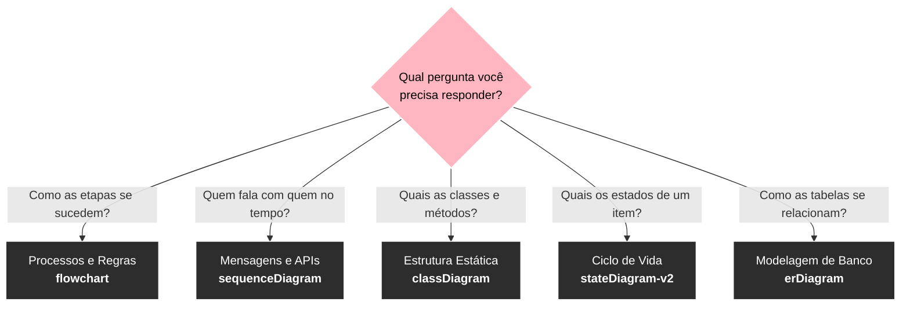

# Como escolher o tipo de diagrama

Um dos erros mais frequentes na documentação de software é tentar resolver todos os problemas com um único tipo de diagrama (geralmente um fluxograma). 

Cada tipo de diagrama do Mermaid foi projetado para responder a uma **pergunta fundamental de engenharia**. Tentar responder à pergunta errada com o diagrama inadequado gera representações confusas e ineficazes.

---

## 1. A matriz de decisão: que pergunta você quer responder?

### Código-fonte do diagrama
````markdown

````

### Visualização renderizada


| O que você quer explicar? | Pergunta norteadora | Diagrama Mermaid |
| :--- | :--- | :--- |
| Lógica de negócio, tomada de decisão e fluxo de telas | *"Qual o próximo passo dependendo das condições?"* | `flowchart TD / LR` |
| Comunicação assíncrona, requisições HTTP e eventos | *"Qual a ordem das mensagens trocadas no tempo?"* | `sequenceDiagram` |
| Arquitetura orientada a objetos, interfaces e tipos | *"Quais atributos e métodos cada classe possui?"* | `classDiagram` |
| Ciclo de vida de uma entidade (`SolicitacaoMentoria`, Pedido) | *"Em quais estados o objeto pode estar e o que dispara a mudança?"* | `stateDiagram-v2` |
| Estrutura de banco de dados relacional | *"Como as chaves e cardinalidades (1:N, N:N) se conectam?"* | `erDiagram` |
| Visão geral de infraestrutura e serviços | *"Quais componentes compõem a arquitetura do sistema?"* | `flowchart TB (Arquitetural)` |

---

## 2. Quando NÃO usar Mermaid

Mermaid é extraordinário para documentação rápida, versionável e integrada ao código. No entanto, ele tem limitações claras decorrentes de sua natureza declarativa:

* **Protótipos de alta fidelidade de UI/UX**: Use Figma. O Mermaid não serve para desenhar telas com espaçamentos milimétricos.
* **Diagramas livres de brainstorm sem regras**: Use Miro, Excalidraw ou FigJam quando precisar de post-its livres e anotações sem topologia rígida.
* **Arquiteturas hipercomplexas com centenas de nós em tela única**: Nenhum motor de grafos automáticos organiza 300 nós sem poluição visual. Divida em múltiplos diagramas com níveis de abstração diferentes.

---

## 3. O princípio da pergunta única

> **Regra de Ouro**: Um diagrama de excelência responde a **uma única pergunta com total clareza**, em vez de tentar explicar todo o sistema de uma só vez.

Se você precisa explicar o fluxo de pagamento de um aplicativo:
* Um `sequenceDiagram` explica a troca de payloads entre cliente, gateway e operadora.
* Um `stateDiagram-v2` explica se a transação está `Pendente`, `Aprovada` ou `Estornada`.
* Um `erDiagram` explica onde o ID da transação fica salvo no banco de dados.

Não tente fundir os três no mesmo desenho. Crie três visões complementares.

---

## 4. Resumo para memorizar

* Escolha o diagrama a partir da pergunta que você precisa responder.
* Use `sequenceDiagram` para tempo e protocolos; `flowchart` para regras e decisões; `stateDiagram-v2` para status; `classDiagram` para OOP; `erDiagram` para banco.
* Se a necessidade for controle manual livre de pixels, use ferramentas de desenho livre em vez de Diagrams as Code.
