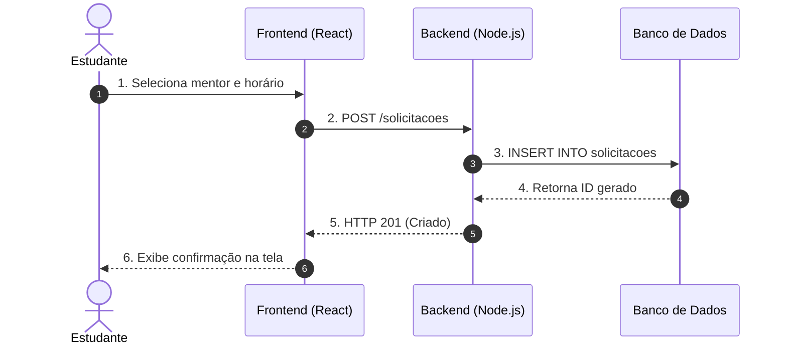
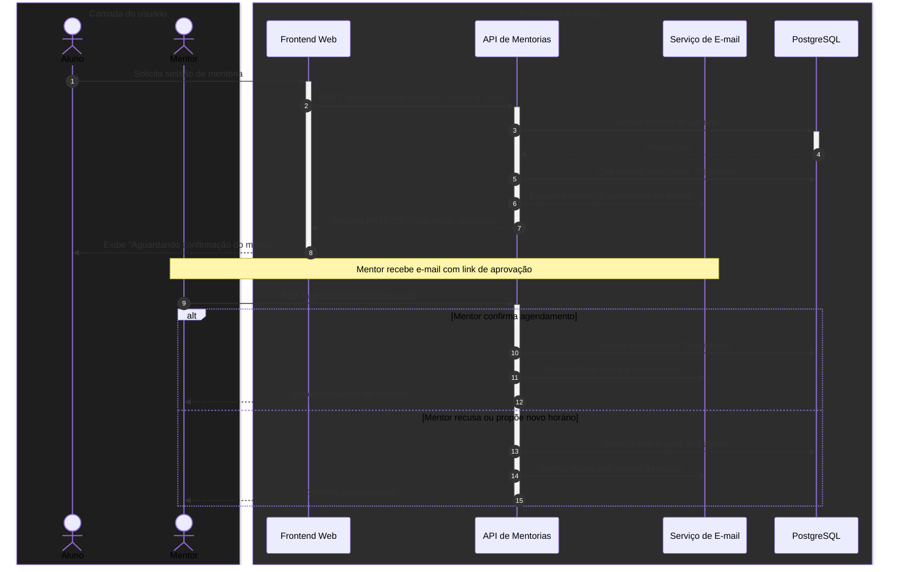

# Diagramas de sequência

O diagrama de sequência (`sequenceDiagram`) é a ferramenta padrão da engenharia de software para mapear **interações e troca de mensagens que ocorrem ao longo do tempo**.

Enquanto um fluxograma mapeia árvores de decisões e bifurcações lógicas, o diagrama de sequência responde com precisão milimétrica à pergunta: *"Em que ordem exata os componentes conversam entre si e quem é responsável por cada etapa do processo?"*

---

## 1. Anatomia do tempo e participantes

Em um diagrama de sequência:
* O **eixo horizontal** representa os participantes (atores humanos, sistemas, microsserviços, bancos de dados).
* O **eixo vertical** representa a **linha do tempo**, que avança continuamente de cima para baixo.

### Código-fonte do diagrama
````markdown

````

### Visualização renderizada


---

## 2. Atores, participantes e caixas de ativação

### 2.1. `actor` versus `participant`
* **`actor`**: Renderiza a figura humana (boneco de palito). Usado exclusivamente para representar usuários humanos (alunos, mentores, administradores).
* **`participant`**: Renderiza retângulos de componentes de código, servidores, filas ou APIs externas.
* **`as`**: Permite definir um apelido curto no código e um rótulo legível e completo no diagrama.

### 2.2. Caixas de ativação (`activate` e `deactivate` ou `+` e `-`)
As barras verticais de ativação indicam visualmente quando um participante está **efetivamente processando uma tarefa** ou aguardando resposta.

---

## 3. Estruturas de controle: `alt`, `opt` e `loop`

Processos reais possuem caminhos alternativos (sucesso vs falha) e etapas condicionais:

* **`alt / else`**: Bifurcação condicional (ex: mentor aceita vs mentor recusa).
* **`opt`**: Passo opcional (ex: usuário opta por receber lembrete via SMS).
* **`loop`**: Tentativas repetidas (*retry*) ou polling periódico.

---

## 4. O sistema unificado: processo completo de solicitação de mentoria

Abaixo, o fluxo integrado de solicitação de mentoria no sistema da PUC, ilustrando atores, ativações, agrupamentos (`box`) e caminhos alternativos:

### Código-fonte do diagrama
````markdown

````

### Visualização renderizada


---

## 5. Resumo para memorizar

* O eixo vertical representa o tempo; mensagens no topo acontecem estritamente antes das mensagens na base.
* Use `actor` para seres humanos e `participant` para serviços e sistemas.
* Use blocos `alt/else` para caminhos de sucesso e erro e `opt` para etapas opcionais.
