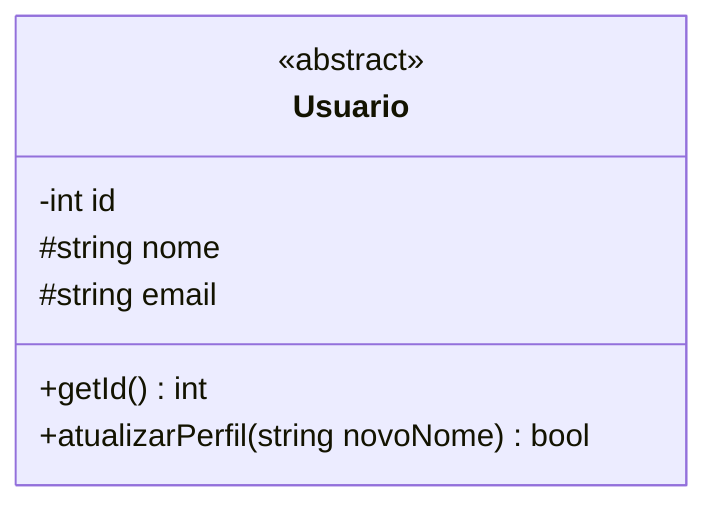
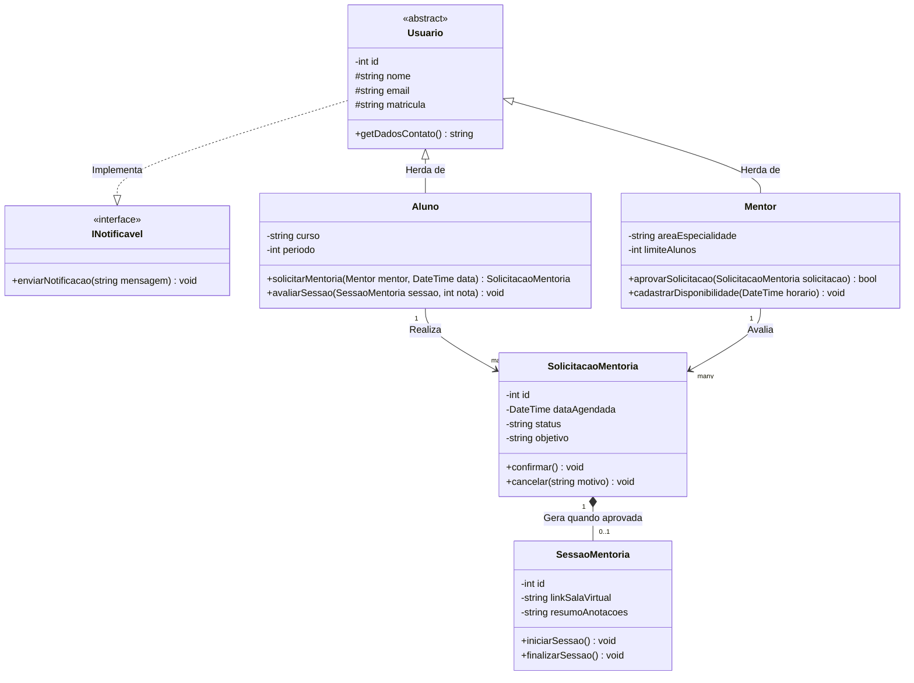

# Diagramas de classes e UML com Mermaid

O diagrama de classes (`classDiagram`) é o pilar central da modelagem de software orientada a objetos (POO). Ele permite mapear a **estrutura estática de um sistema**: quais classes existem, quais atributos e métodos elas possuem, quais contratos de interface implementam e como se conectam entre si.

---

## 1. Anatomia de uma classe no Mermaid

Uma classe é dividida em três partes principais:
1. **Nome da classe** (e estereótipos como `<<interface>>` ou `<<abstract>>`).
2. **Atributos (propriedades)** com modificadores de visibilidade.
3. **Métodos (funções/operações)** com tipos de retorno.

---

## 2. Modificadores de visibilidade e membros especiais

* `+` : **Público (`public`)** — acessível por qualquer parte do sistema.
* `-` : **Privado (`private`)** — acessível apenas dentro da própria classe (encapsulamento estrito).
* `#` : **Protegido (`protected`)** — acessível pela classe e por suas subclasses.
* `~` : **Pacote / Interno (`internal`)** — acessível dentro do mesmo módulo.
* `{abstract}` : Método ou classe que precisa ser implementado por uma subclasse.
* `{static}` : Atributo ou método estático pertencente à classe, e não à instância.

---

## 3. Relacionamentos fundamentais entre classes

A forma como duas classes se conectam define o nível de acoplamento e dependência entre elas:

| Sintaxe | Nome da relação | Significado prático | Analogia do mundo real |
| :--- | :--- | :--- | :--- |
| `<|--` | **Herança (*Inheritance*)** | Subclasse herda de Superclasse | `Aluno` é um tipo de `Usuario` |
| `..|>` | **Realização (*Interface*)** | Classe cumpre um contrato definido | `ServicoEmail` implementa `INotificador` |
| `*--` | **Composição forte** | O filho não existe sem o pai | O `ItemAgendamento` morre se o `Agendamento` for apagado |
| `o--` | **Agregação fraca** | O elemento existe de forma independente | O `Curso` tem vários `Alunos`, mas o aluno continua existindo sem o curso |
| `-->` | **Associação** | Uma classe conhece e usa outra | O `Mentor` possui uma `Disponibilidade` |

---

## 4. O sistema unificado: modelo de domínio da plataforma de mentorias

Abaixo, a modelagem completa das entidades de domínio do sistema de mentorias acadêmicas:

---

## 5. Resumo para memorizar

* Use `classDiagram` para projetar a estrutura de objetos antes de escrever código em C#, TypeScript ou Java.
* Use `*--` para composição (dependência existencial estrita) e `o--` para agregação (existência independente).
* Defina visibilidades claras (`-` para privado, `+` para público) para reforçar boas práticas de encapsulamento.
