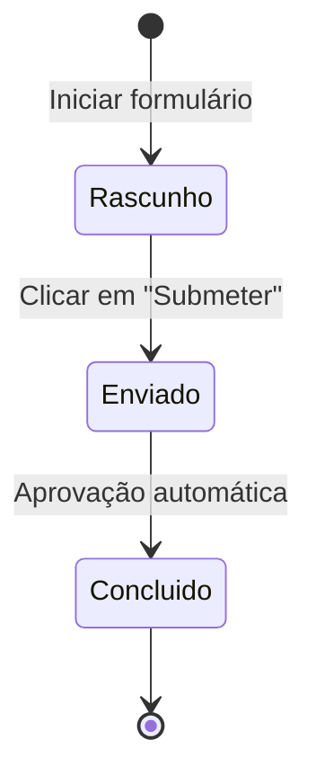
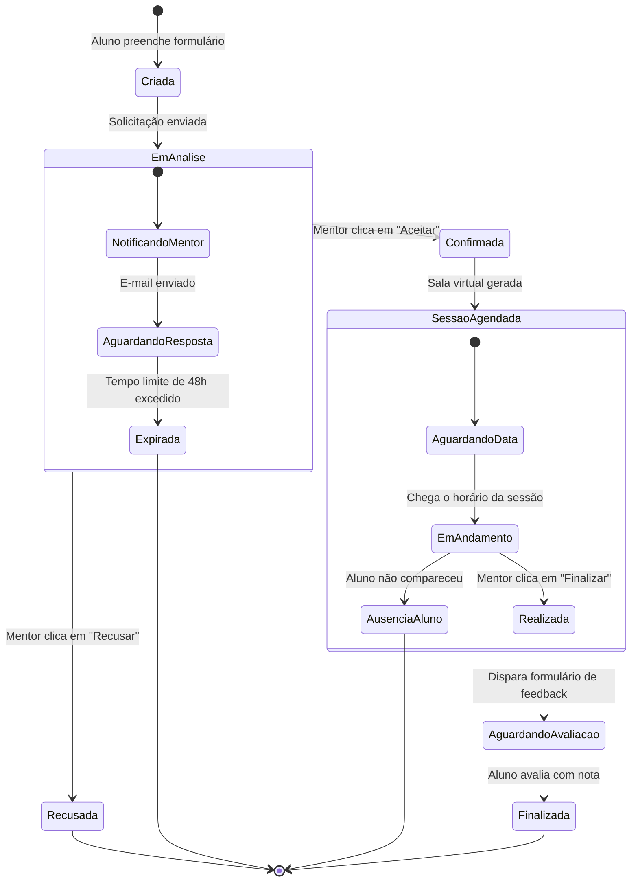

# Diagramas de estado

Enquanto diagramas de sequência focam em interações entre múltiplos componentes e diagramas de classe focam na estrutura estática, o **diagrama de estados (`stateDiagram-v2`)** tem um foco cirúrgico: o **ciclo de vida de uma única entidade ao longo do tempo**.

Ele responde à pergunta: *"Quais são todos os estados possíveis que este objeto pode assumir, quais eventos disparam a transição de um estado para outro e quais caminhos são estritamente proibidos pelas regras de negócio?"*

---

## 1. Elementos fundamentais do diagrama de estados

* **`[*]` (Ponto inicial / terminal)**: Marca a criação inicial do objeto ou sua destruição/encerramento final.
* **Estado (`NomeDoEstado`)**: Uma condição ou situação na qual a entidade permanece aguardando um evento.
* **Transição (`-->`)**: A passagem de um estado para outro, anotada com `: evento / gatilho`.
* **Estado composto (`state Grupo { ... }`)**: Agrupa sub-estados que compartilham o mesmo contexto maior.
* **Decisão (`<<choice>>`)**: Um ponto onde regras lógicas decidem o próximo estado de destino.

---

## 2. A analogia do semáforo e das máquinas de estado

Uma máquina de estados finita (*Finite State Machine - FSM*) garante que um sistema nunca entre em uma combinação ilegal ou inconsistente. 

Pense em um semáforo de trânsito:
* Ele vai de **Verde** $\rightarrow$ **Amarelo** $\rightarrow$ **Vermelho** $\rightarrow$ **Verde**.
* É fisicamente e logicamente impossível passar direto de **Vermelho** para **Amarelo** no modelo tradicional brasileiro.
* O diagrama de estados torna essas regras explícitas e à prova de ambiguidades.

---

## 3. O sistema unificado: ciclo de vida de `SolicitacaoMentoria`

Abaixo, a máquina de estados completa que rege uma solicitação de mentoria na plataforma acadêmica:

---

## 4. Como estados evitam bugs no código

Mapear estados no Mermaid antes de programar ajuda a estruturar o código no frontend e backend:
* No **React/Frontend**: Ajuda a definir claramente os estados da interface (`idle`, `loading`, `success`, `error`), evitando exibir botões de ação em momentos indevidos.
* No **Backend/C#/Node**: Ajuda a criar validações defensivas (ex: *"Não é possível cancelar uma mentoria que já possui o status 'Realizada'"*).

---

## 5. Resumo para memorizar

* Use `stateDiagram-v2` para mapear o ciclo de vida e os status válidos de uma entidade de negócio.
* `[*]` marca tanto a origem da criação quanto os pontos finais de encerramento.
* Estados compostos ajudam a organizar fases complexas sem poluir a visão geral do ciclo.
