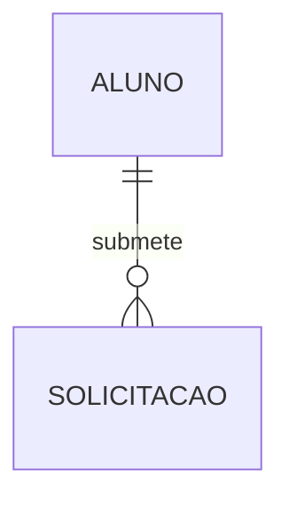
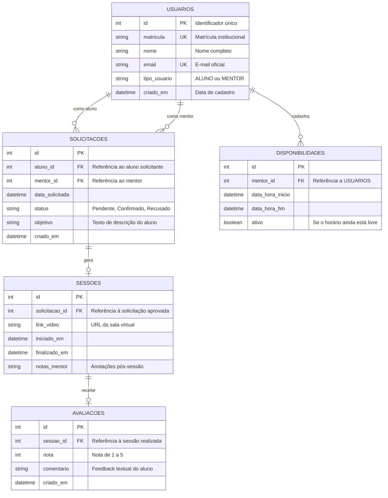

# ER e modelagem de dados

O diagrama de entidade e relacionamento (`erDiagram`) é a ferramenta padrão para modelar a **camada de persistência de dados**. Ele define quais entidades (tabelas) existem no banco de dados, quais atributos (colunas) elas armazenam e quais restrições de relacionamento (cardinalidades) conectam as chaves primárias e estrangeiras.

---

## 1. Cardinalidades fundamentais no Mermaid

No Mermaid, a sintaxe de cardinalidade utiliza conectores intuitivos que desenham a notação clássica de *Pé de Galinha* (*Crow's Foot*):

| Sintaxe | Relação | Descrição |
| :--- | :--- | :--- |
| `||--||` | Exatamente 1 para exatamente 1 | Relação estrita e exclusiva (1:1) |
| `||--o{` | 1 para zero ou muitos | Um registro pai pode ter nenhum ou vários filhos (1:N) |
| `||--|{` | 1 para um ou muitos | Um registro pai deve ter pelo menos um filho (1:N obrigatório) |
| `|o--o|` | Zero ou 1 para zero ou 1 | Relação opcional em ambos os lados |
| `}o--o{` | Zero ou muitos para zero ou muitos | Relação N:N (muitos para muitos) |

### Código-fonte do diagrama
````markdown

````

### Visualização renderizada


---

## 2. Tipos de dados, atributos e restrições

Dentro de cada bloco de entidade, listamos as colunas com:
1. **Tipo de dado**: `int`, `string`, `datetime`, `boolean`, `decimal`.
2. **Nome da coluna**: `id`, `nome_completo`, `criado_em`.
3. **Chave ou restrição**: `PK` (*Primary Key*), `FK` (*Foreign Key*), `UK` (*Unique Key*).
4. **Comentário opcional**: texto entre aspas para descrever o propósito do campo.

---

## 3. O sistema unificado: modelo de dados relacional da plataforma de mentorias

Abaixo, a modelagem completa das tabelas e chaves do banco de dados relacional do sistema:

### Código-fonte do diagrama
````markdown

````

### Visualização renderizada


---

## 4. Diferença entre `classDiagram` e `erDiagram`

É comum confundir a modelagem de classes com a modelagem ER. A distinção é clara:

* **Diagrama de classes (`classDiagram`)**: Modela o **comportamento em memória** (métodos, herança, polimorfismo, interfaces e regras de negócio ativas na aplicação).
* **Diagrama ER (`erDiagram`)**: Modela o **armazenamento persistente no disco** (tabelas, colunas, tipos primitivos, chaves primárias e integridade referencial do banco SQL).

---

## 5. Resumo para memorizar

* Use `erDiagram` para planejar schemas de banco de dados e migrações SQL.
* As cardinalidades seguem a notação *Pé de Galinha* (`||--o{` para 1:N).
* Especifique claramente as chaves primárias (`PK`) e estrangeiras (`FK`) para manter a rastreabilidade do modelo.
