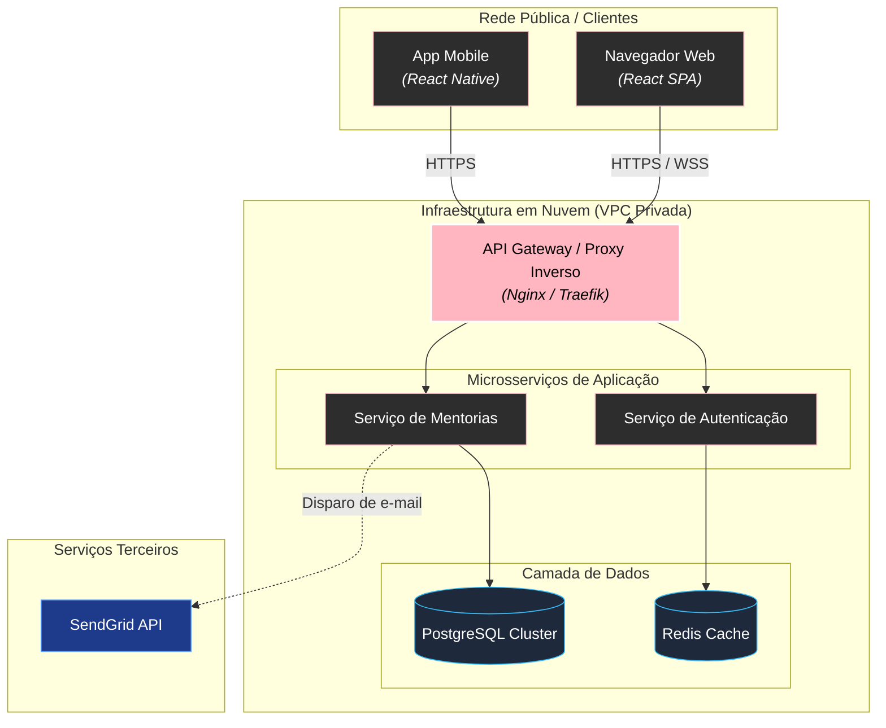
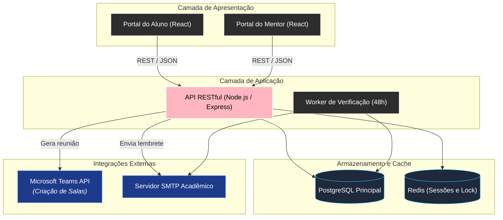

# Arquitetura de software com Mermaid

Modelar arquitetura de software significa comunicar a **visão sistêmica**: quais são os blocos construtivos da aplicação (frontend, APIs, mensageria, bancos de dados, microsserviços), como eles se comunicam através da rede e onde estão as fronteiras de segurança e infraestrutura.

---

## 1. O modelo C4 simplificado com Mermaid

O modelo C4 (Contexto, Contêineres, Componentes e Código) é o padrão da indústria para documentar arquiteturas em múltiplos níveis de zoom. Com o Mermaid, usamos `flowchart TB` estruturado com `subgraph` para modelar os dois primeiros níveis:

* **Nível 1 (Contexto do Sistema)**: O sistema como uma caixa preta e os atores/sistemas externos que interagem com ele.
* **Nível 2 (Contêineres de Aplicação)**: As aplicações executáveis reais (Single Page Application React, API Gateway, Workers, Bancos de Dados).

---

## 2. Fronteiras de rede e isolamento com `subgraph`

Subgrafos aninhados permitem desenhar zonas de segurança e camadas lógicas de infraestrutura:

### Código-fonte do diagrama
````markdown

````

### Visualização renderizada


---

## 3. O sistema unificado: arquitetura completa da plataforma de mentorias

Abaixo, a arquitetura de implantação da aplicação acadêmica de mentorias:

### Código-fonte do diagrama
````markdown

````

### Visualização renderizada


---

## 4. Resumo para memorizar

* Use `flowchart TB` com `subgraph` para documentar arquiteturas por camadas (clientes, gateway, serviços, banco).
* Aplique o sistema semântico de cores para diferenciar serviços internos de APIs externas e bancos de dados.
* Limite o escopo de cada diagrama para não misturar detalhes de código com topologia de servidores.
