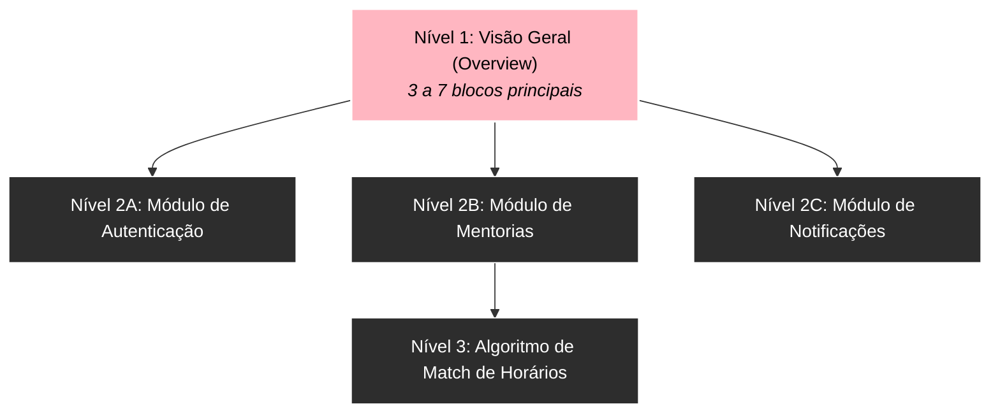

# Controle de complexidade em diagramas grandes

À medida que os sistemas de software crescem, a tendência natural é tentar adicionar mais nós e conexões ao mesmo diagrama. Em pouco tempo, o documento atinge um ponto de saturação visual: dezenas de setas se cruzam, nós ficam minúsculos e o diagrama perde sua utilidade primária.

> **Princípio Fundamental**: Um diagrama complexo não precisa representar toda a complexidade do sistema simultaneamente.

---

## 1. A estratégia do *Overview + Drill-down*

A técnica mais eficaz para controlar a complexidade é a decomposição em níveis de profundidade:

### Código-fonte do diagrama
````markdown

````

### Visualização renderizada


* **Diagrama de Nível 1 (Overview)**: Apresenta os subsistemas em blocos macro (ex: Frontend, API Gateway, Núcleo de Negócios, Persistência).
* **Diagramas de Nível 2 (Drill-down)**: Cada subsistema possui seu próprio artigo dedicado detalhando seus componentes internos.

---

## 2. Técnicas de redução de ruído visual

1. **Evite o padrão "Teia de Aranha"**: Se 10 nós precisam falar com o banco de dados, não puxe 10 setas diretas cruzando o diagrama inteiro. Conecte os serviços a uma camada intermediária (*Data Access Layer*) ou utilize um subgraph de agrupamento.
2. **Separe Estrutura de Comportamento**: Não tente documentar classes e chamadas assíncronas na mesma imagem. Use `classDiagram` para a estrutura de tipos e `sequenceDiagram` para o fluxo de eventos.
3. **Limite o número de nós por diagrama**: Uma boa métrica é manter entre **7 e 15 nós principais** por visualização.

---

## 3. Exemplo prático de decomposição

Em vez de desenhar um diagrama monolítico contendo todos os campos, regras de validação e integrações de e-mail, decompomos o sistema em:

1. Visão de contexto macro (Arquitetura).
2. Fluxo da jornada do usuário (Flowchart simplificado).
3. Protocolo de troca de mensagens (Sequence Diagram).

---

## 4. Resumo para memorizar

* Um diagrama que tenta mostrar tudo acaba não comunicando nada.
* Use a abordagem *Overview + Drill-down* para dividir sistemas grandes em camadas lógicas navegáveis.
* Reduza a densidade de conexões cruzadas agrupando serviços em interfaces unificadas.
