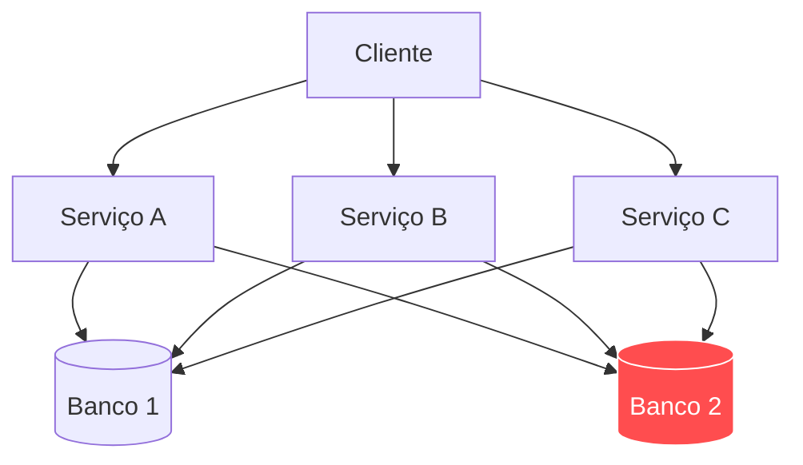
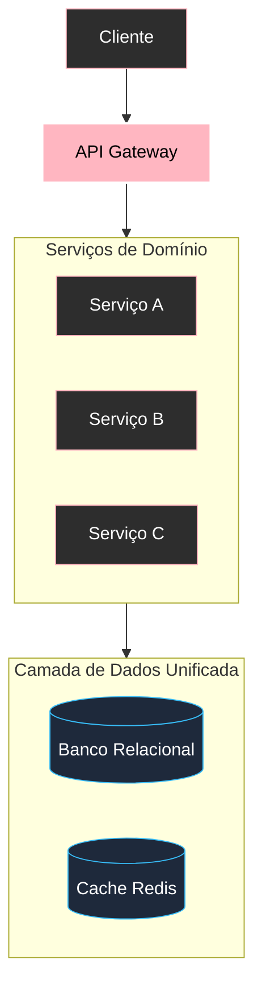

# Padrões, antipadrões e refatoração de diagramas

Assim como o código-fonte acumula débitos técnicos e *code smells*, diagramas em Mermaid frequentemente sofrem de **antipadrões visuais** que prejudicam a leitura e a manutenção da documentação.

---

## 1. Os três antipadrões mais comuns

### 1.1. O antipadrão "Minhoca Horizontal"
* **Sintoma**: Um fluxo linear gigantesco em `flowchart LR` que força uma barra de rolagem horizontal quilométrica.
* **Causa**: Excesso de nós em sequência estrita sem agrupamento modular.
* **Solução**: Mudar para `flowchart TD` ou quebrar a cadeia em blocos funcionais com subgrafos.

### 1.2. O antipadrão "Arranha-céu Vertical"
* **Sintoma**: Um diagrama `flowchart TD` com 30 passos consecutivos sem ramificações.
* **Solução**: Modularizar o processo em macroetapas ou usar uma tabela de passos quando não houver bifurcações reais.

### 1.3. O antipadrão "Ninho de Mafagafos" (*Edge Crossing Hell*)
* **Sintoma**: Centenas de setas se cruzando por cima de caixas e textos.
* **Solução**: Introduzir nós intermediários (Hubs/Gateways) e aplicar subgrafos com isolamento de contexto.

---

## 2. Refatoração na prática: Antes e Depois

### Antes: Diagrama poluído com conexões cruzadas
#### Código-fonte
````markdown

````

#### Visualização renderizada


### Depois: Refatoração com Gateway e Camada de Dados
#### Código-fonte
````markdown

````

#### Visualização renderizada


---

## 3. Checklist de refatoração visual

- [ ] Os rótulos de nós com mais de 3 palavras utilizam quebra de linha com `<br>`?
- [ ] As strings e rótulos que contêm caracteres especiais estão entre aspas duplas `""`?
- [ ] O diagrama possui menos de 20 nós principais visíveis?
- [ ] A direção (`TD` ou `LR`) respeita a semântica de hierarquia versus tempo?
- [ ] As classes de estilo semânticas (`:::core`, `:::component`, `:::data`) foram aplicadas?

---

## 4. Resumo para memorizar

* Identifique e elimine antipadrões visuais (minhocas, arranha-céus e ninhos de conexões cruzadas).
* Refatore diagramas introduzindo nós intermediários e subgrafos modulares.
* Mantenha textos compactos e claros utilizando `<br>` a cada duas ou três palavras.
