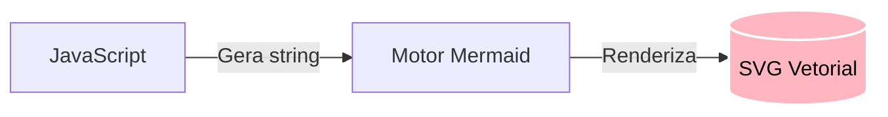

# Mermaid dinâmico com JavaScript

Além de escrever blocos estáticos de Mermaid em arquivos Markdown, você pode utilizar a biblioteca JavaScript nativa do Mermaid (`mermaid.js`) para **gerar, renderizar e manipular diagramas dinamicamente** em aplicações web e painéis interativos.

---

## 1. Importação e inicialização no navegador

Para carregar o Mermaid via CDN em uma página HTML ou aplicação Vanilla JS/React:

```html
<!DOCTYPE html>
<html lang="pt-BR">
<head>
    <meta charset="UTF-8">
    <title>Mermaid Dinâmico</title>
    <!-- Importando a biblioteca oficial Mermaid v11+ -->
    <script src="https://cdn.jsdelivr.net/npm/mermaid@11/dist/mermaid.min.js"></script>
</head>
<body>
    <div id="diagrama-container"></div>

    <script type="module">
        mermaid.initialize({
            startOnLoad: false,
            theme: "dark",
            securityLevel: "loose",
            flowchart: {
                useMaxWidth: true,
                htmlLabels: true,
                curve: "basis"
            }
        });
    </script>
</body>
</html>
```

---

## 2. Renderização programática com `mermaid.render()`

A função assíncrona `mermaid.render(id, codigo)` recebe uma string de código Mermaid e retorna o código SVG compilado:

```javascript
async function desenharDiagrama() {
    const container = document.getElementById("diagrama-container");
    
    const codigoMermaid = `
    flowchart LR
        classDef core fill:#ffb6c1,stroke:#ffffff,stroke-width:2px,color:#000000;
        
        JS["JavaScript"] -->|Gera string| Mermaid["Motor Mermaid"]
        Mermaid -->|Renderiza| SVG[("SVG Vetorial")]:::core
    `;

    try {
        const { svg } = await mermaid.render("meu-grafico-svg", codigoMermaid);
        container.innerHTML = svg;
    } catch (erro) {
        console.error("Erro ao compilar o diagrama Mermaid:", erro);
    }
}

desenharDiagrama();
```

### Código-fonte do diagrama conceitual
````markdown

````

### Visualização renderizada


---

## 3. Gerando diagramas a partir de dados reais (JSON)

Um caso de uso comum no desenvolvimento web é transformar um array de objetos ou resposta de API diretamente em um gráfico Mermaid:

```javascript
// Dados vindos de uma API REST
const mentores = [
    { nome: "Ana Silva", area: "Frontend", status: "Disponivel" },
    { nome: "Carlos Souza", area: "Backend", status: "Ocupado" },
    { nome: "Beatriz Lima", area: "UX Design", status: "Disponivel" }
];

function gerarMermaidDeUsuarios(dados) {
    let linhas = ["flowchart TD", "    classDef disp fill:#10b981,color:#ffffff;", "    classDef ocup fill:#ef4444,color:#ffffff;"];
    
    linhas.push(`    Coord["Coordenação de Mentorias"]`);

    dados.forEach((mentor, index) => {
        const id = `mentor_${index}`;
        const classe = mentor.status === "Disponivel" ? ":::disp" : ":::ocup";
        linhas.push(`    Coord --> ${id}["${mentor.nome}<br><i>(${mentor.area})</i>"]${classe}`);
    });

    return linhas.join("\n");
}

console.log(gerarMermaidDeUsuarios(mentores));
```

---

## 4. Resumo para memorizar

* O Mermaid pode ser importado diretamente no navegador como módulo ES6 via CDN.
* Use `mermaid.initialize()` para configurar temas escuros e regras de renderização.
* Com `mermaid.render()`, você pode gerar visualizações de grafos ricas e responsivas a partir de qualquer estrutura de dados JSON da sua aplicação.
