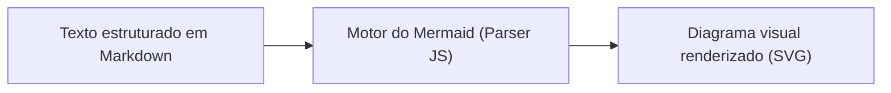
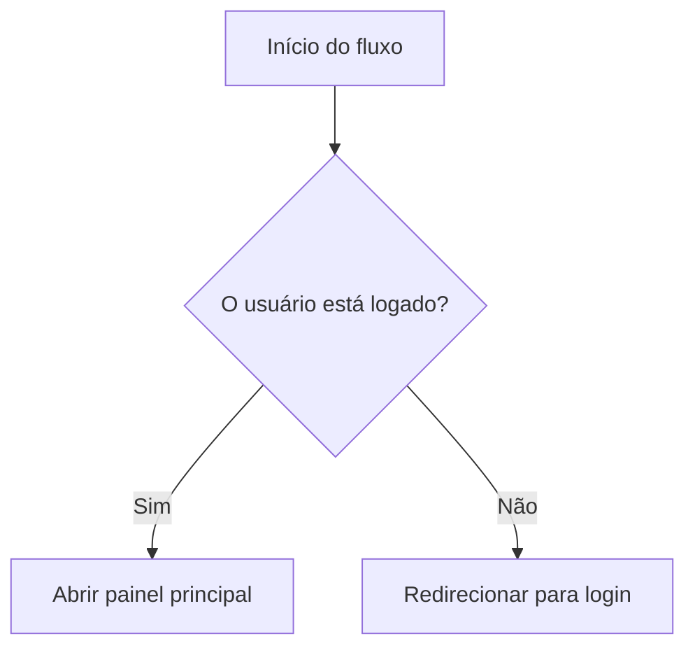
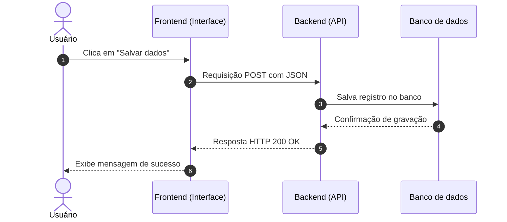
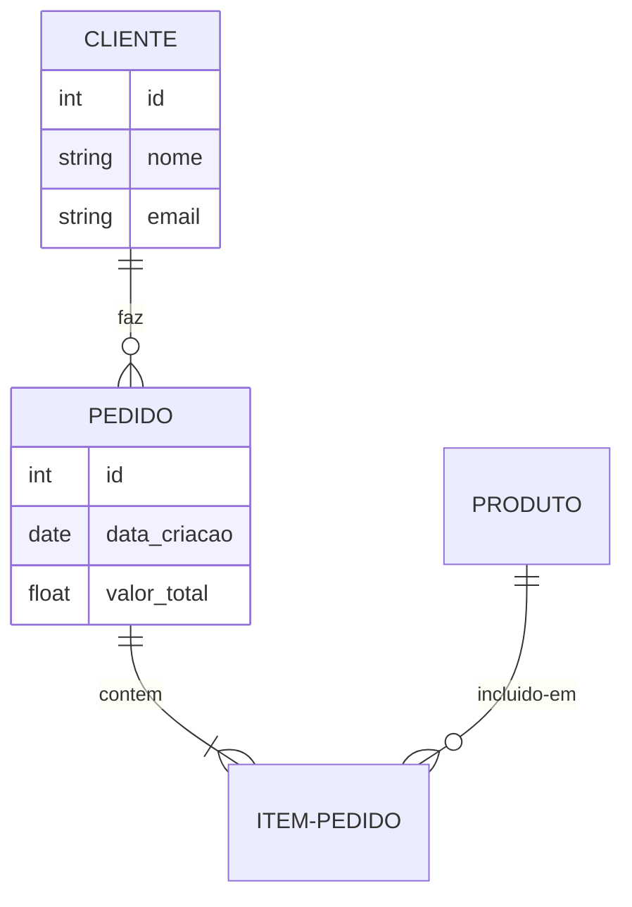
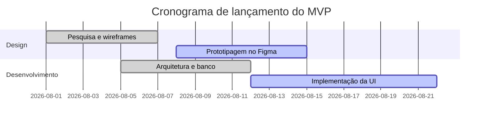

# Introdução ao Mermaid

Mermaid é uma ferramenta baseada em [[javascript/Introdução ao JavaScript|JavaScript]] que transforma texto simples e estruturado em diagramas e visualizações gráficas de forma automática.

Em vez de desenhar caixas e setas manualmente arrastando elementos em softwares gráficos, você escreve instruções em Markdown e o Mermaid compila essa estrutura em gráficos vetoriais (SVG).

---

## Analogia visual: Mermaid vs softwares de desenho

Pense na diferença entre:
* **Desenhar no Illustrator / Figma manualmente**: você precisa criar cada retângulo, alinhar pixels, puxar conectores e reajustar tudo manualmente sempre que um novo passo for inserido no fluxo.
* **Auto Layout com código no Mermaid**: você apenas lista as etapas e as relações entre elas (ex: `A --> B`). O motor do Mermaid calcula automaticamente as distâncias, alinhamentos, setas e quebras de linha para você.

---

## Como o Mermaid funciona por baixo dos panos

O funcionamento do Mermaid segue três passos principais:

1. **Declaração do tipo de diagrama**: A primeira linha do bloco define qual modelo visual será montado (fluxograma, diagrama de sequência, mapa mental, gráfico de Gantt, etc.).
2. **Interpretação da sintaxe (Parsing)**: O script do Mermaid lê o texto linha por linha, identificando nós (elementos), conexões (arestas/setas) e rótulos.
3. **Renderização vetorial (SVG)**: A biblioteca gera elementos `<svg>` diretamente na página HTML ou na interface do Obsidian, garantindo nitidez em qualquer nível de zoom.

---

## Principais tipos de diagramas

### 1. Fluxogramas (`flowchart`)
Ideal para mapear tomadas de decisão, jornadas de usuário e rotinas de código.

Sintaxe básica de direções:
* `TD` ou `TB`: Top to Bottom (de cima para baixo).
* `BT`: Bottom to Top (de baixo para cima).
* `LR`: Left to Right (da esquerda para a direita).
* `RL`: Right to Left (da direita para a esquerda).

Formatos de nós:
* `[Texto]` = Retângulo padrão.
* `(Texto)` = Retângulo com cantos arredondados.
* `([Texto])` = Formato de pílula (estádio).
* `{"Texto"}` = Losango de decisão.
* `[("Texto")]` = Cilindro (banco de dados).

---

### 2. Diagramas de sequência (`sequenceDiagram`)
Mostra a troca de mensagens e eventos entre diferentes sistemas ou atores ao longo do tempo (linha do tempo vertical).

---

### 3. Diagramas de entidade e relacionamento (`erDiagram`)
Representa tabelas de bancos de dados relacionais e a cardinalidade entre elas.

---

### 4. Gráficos de Gantt (`gantt`)
Perfeito para cronogramas de projetos, sprints de produto e roadmap de entregas.

---

## Boas práticas no Obsidian e no Web App

1. **Aspas em rótulos**: Sempre envolva textos que contenham parênteses, traços ou caracteres especiais entre aspas duplas dentro dos nós (ex: `A["Nome (Detalhe)"]`).
2. **Evite números seguidos de ponto**: Evite iniciar o texto de nós com números e pontos como `1. Passo`, pois alguns parsers de Markdown tentam interpretar como listas numéricas e acusam erro de renderização. Prefira `1 - Passo`.
3. **Nomes sem espaços nos identificadores**: Use IDs curtos e limpos para os nós (ex: `A`, `B`, `LoginNode`, `UserDb`) e coloque o texto legível entre colchetes.

---

## Resumo para memorizar

* **Mermaid** é código que vira diagrama visual automaticamente (Diagrams as Code).
* Elimina a necessidade de redesenhar conexões manualmente quando o fluxo muda.
* Funciona nativamente no Obsidian, no GitHub e em aplicações web via biblioteca JavaScript.
* Os tipos mais usados no dia a dia de desenvolvimento e produto são `flowchart`, `sequenceDiagram` e `erDiagram`.
