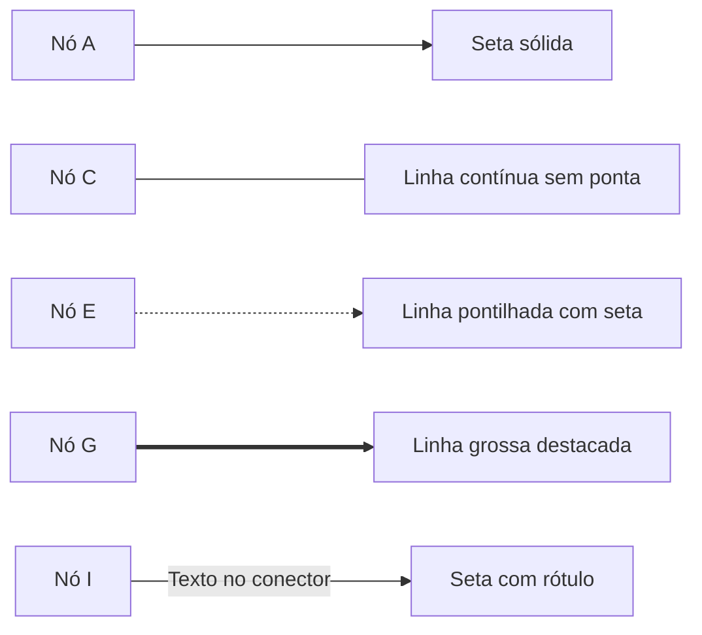
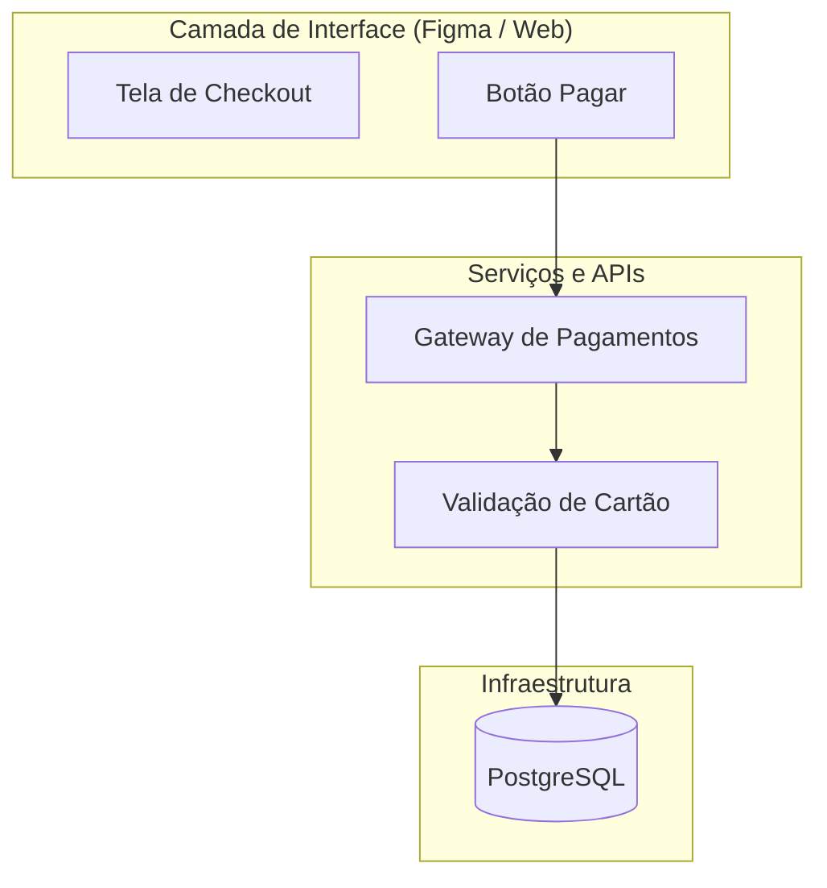
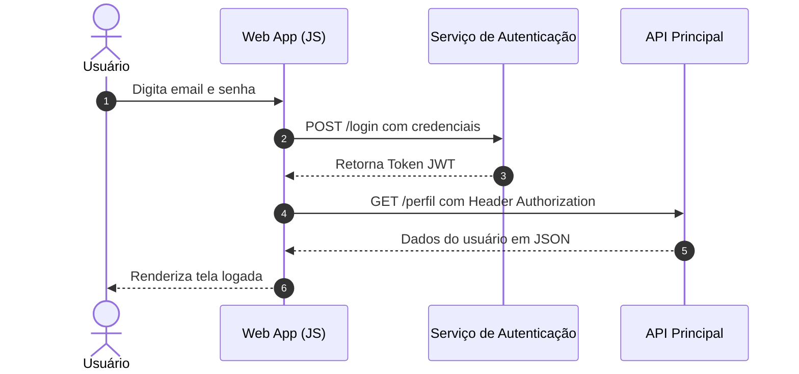
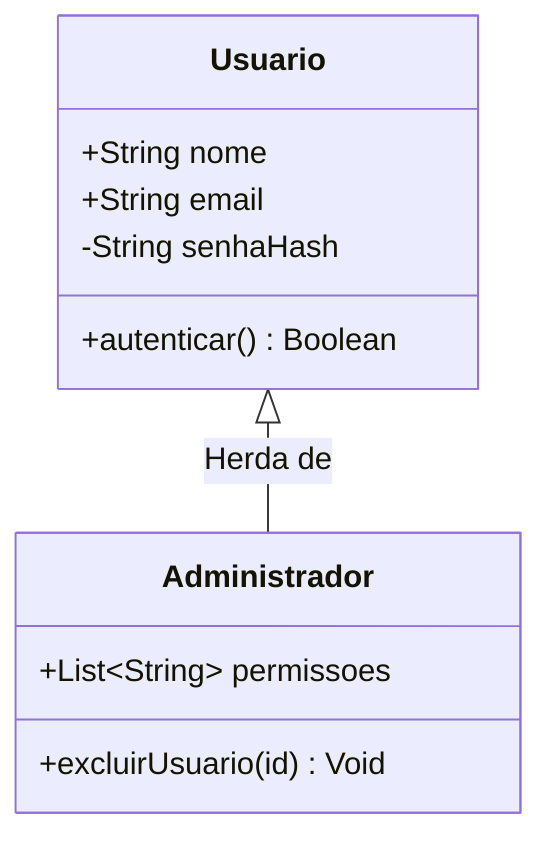
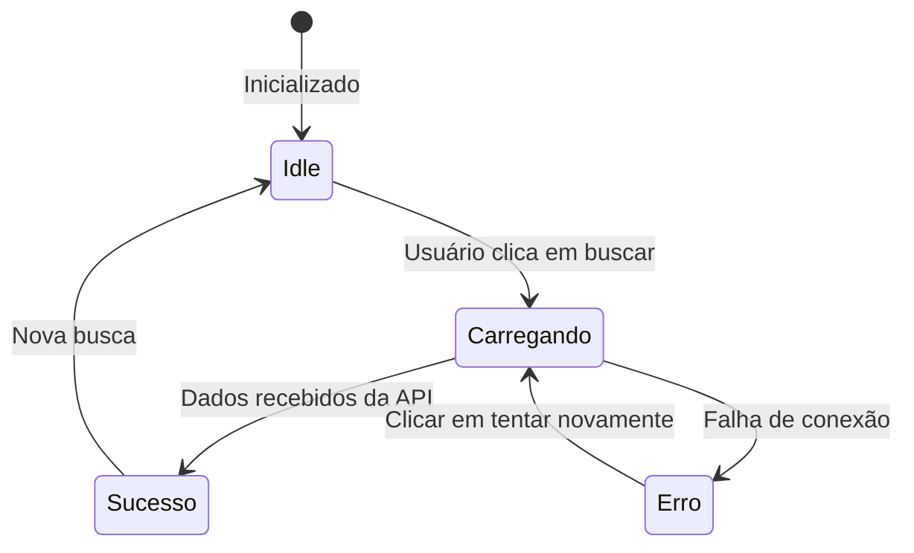
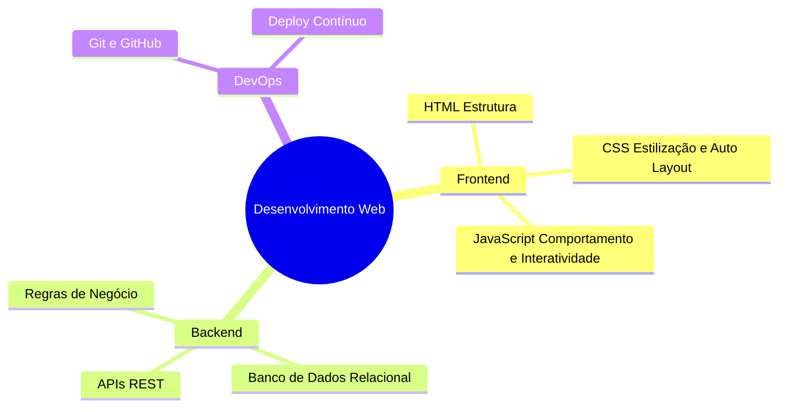
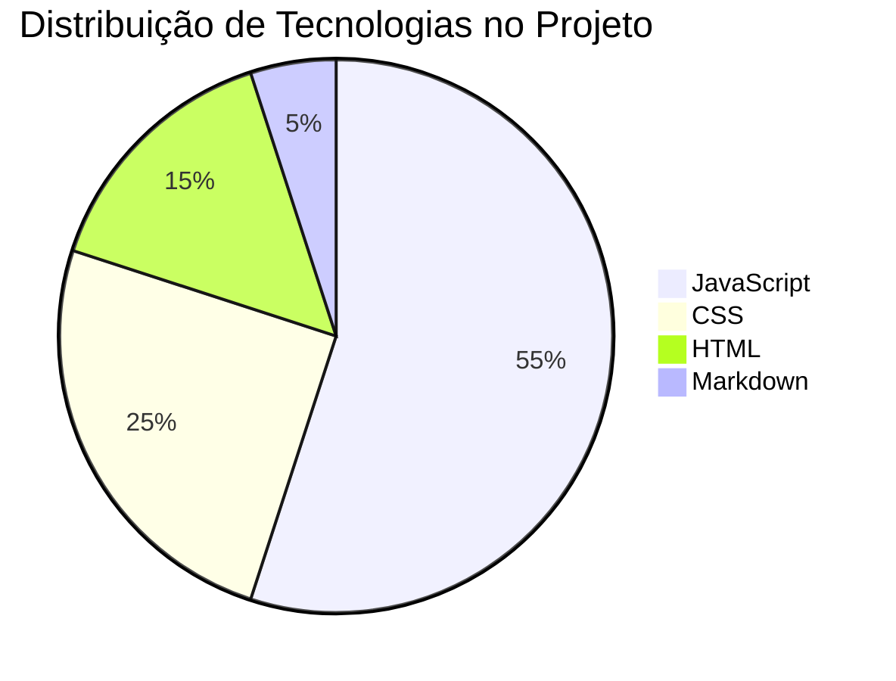

# Sintaxe e possibilidades com Mermaid

O Mermaid permite transformar texto estruturado em dezenas de formatos visuais. Este guia detalha a sintaxe prática, os tipos de nós, conectores e os diagramas mais utilizados em arquitetura de software, design de produto e fluxos lógicos.

---

## 1. Anatomia básica de um bloco Mermaid

Todo diagrama começa com a declaração do tipo de gráfico, seguido pelas definições dos nós e suas conexões:

````markdown
```mermaid
tipo-do-diagrama [direção]
    id_origem["Rótulo visível"] --> id_destino["Rótulo visível"]
```
````

---

## 2. Fluxogramas (`flowchart`): sintaxe completa

O `flowchart` é o modelo mais flexível. Ele suporta orientações direcionais, múltiplos formatos geométricos e estilização de linhas.

### Orientações de layout
* `TD` ou `TB`: Top to Bottom (vertical, de cima para baixo).
* `BT`: Bottom to Top (vertical, de baixo para cima).
* `LR`: Left to Right (horizontal, da esquerda para a direita).
* `RL`: Right to Left (horizontal, da direita para a esquerda).

### Formatos de formas geométricas (nós)

| Forma visual | Sintaxe no código | Exemplo de uso |
| :--- | :--- | :--- |
| Retângulo padrão | `id["Texto"]` | Etapa de processamento |
| Cantos arredondados | `id("Texto")` | Ação de interface ou evento |
| Pílula / Estádio | `id(["Texto"])` | Início ou fim de fluxo |
| Losango (Decisão) | `id{"Texto"}` | Condicionais `if / else` |
| Círculo | `id(("Texto"))` | Ponto de junção / Conector |
| Cilindro de banco | `id[("Texto")]` | Banco de dados ou armazenamento |
| Sub-rotina | `id[["Texto"]]` | Função externa ou módulo |
| Trapézio invertido | `id[\"Texto\"/]` | Entrada manual de dados |

### Tipos de conexões e setas



### Agrupamento em sub-grafos (`subgraph`)
Permite criar caixas delimitadoras para agrupar módulos ou camadas de uma aplicação:



---

## 3. Diagrama de sequência (`sequenceDiagram`)

Excelente para mapear a linha do tempo de interações assíncronas entre frontend, APIs e serviços externos.



Tipos de flechas em sequências:
* `->>`: Mensagem síncrona com ponta sólida.
* `-->>`: Resposta de mensagem com linha pontilhada.
* `-x`: Mensagem síncrona com erro ou bloqueio.
* `-)`: Mensagem assíncrona.

---

## 4. Diagrama de classes e modelagem (`classDiagram`)

Permite documentar a estrutura de [[javascript/02-funcoes-e-objetos/09-Classes|Classes]] e programação orientada a objetos:



---

## 5. Diagrama de estados (`stateDiagram-v2`)

Mapeia a máquina de estados de componentes de UI (ex: loading, erro, sucesso, desabilitado):



---

## 6. Mapas mentais (`mindmap`)

Ideal para brainstorms estruturados, arquitetura de informação e hierarquia de tópicos:



---

## 7. Gráficos de pizza (`pie`)

Permite gerar visualizações percentuais e métricas rápidas diretamente no texto:



---

## Boas práticas de escrita para evitar erros

1. **Sempre use aspas duplas nos textos dos nós**: Se o texto contiver caracteres como `()`, `[]`, `/` ou `:`, as aspas evitam erros de sintaxe no compilador do Mermaid.
2. **Evite numeração sequencial com ponto**: Nunca inicie rótulos com `1. Passo`, pois o motor pode interpretar como lista Markdown. Use `1 - Passo`.
3. **Mantenha IDs simples**: Nomeie os nós com identificadores curtos (`UserNode`, `CheckoutBtn`, `ApiGateway`) e passe o texto explicativo dentro dos colchetes.

---

## Resumo para memorizar

* A primeira linha sempre define o **tipo de gráfico** (`flowchart`, `sequenceDiagram`, `stateDiagram-v2`, `mindmap`, `erDiagram`, `classDiagram`, `pie`).
* No `flowchart`, os delimitadores definem a forma: `[]` retângulo, `()` arredondado, `([])` pílula, `{}` losango, `[()]` cilindro.
* As conexões representam o sentido do dado: `-->` (com seta), `---` (sem seta), `-.->` (pontilhada), `==>` (destaque).
* Sub-grafos (`subgraph`) permitem organizar sistemas complexos em camadas visuais claras.
