# Sintaxe e possibilidades com Mermaid

O Mermaid é uma ferramenta de **Diagrams as Code** baseada em JavaScript que compila texto simples e estruturado em gráficos vetoriais (SVG). Ele permite documentar fluxos de usuário, arquiteturas de sistemas, ciclos de vida de telas, bancos de dados e cronogramas diretamente no código ou nas notas do Obsidian.

Este guia reúne de forma exaustiva as possibilidades, tipos de diagramas, geometrias, conectores, comandos avançados e boas práticas de modelagem.

---

## 1. Anatomia universal de um bloco Mermaid

Todo bloco Mermaid inicia com a cerca tripla de código indicando a linguagem `mermaid`, seguida pela declaração do tipo de gráfico na primeira linha:

````markdown
```mermaid
tipo-do-diagrama [direção/parâmetros]
    %% Comentários começam com dois sinais de porcentagem
    id_origem["Rótulo visível"] --> id_destino["Rótulo visível"]
```
````

---

## 2. Fluxogramas (`flowchart`)

O `flowchart` é o diagrama mais versátil da biblioteca, ideal para fluxos condicionais (`if/else`), jornadas de navegação e rotinas de backend.

### Orientações de layout
* `TD` ou `TB`: Top to Bottom (vertical, de cima para baixo). Layout prioritário para mobile.
* `BT`: Bottom to Top (vertical, de baixo para cima).
* `LR`: Left to Right (horizontal, da esquerda para a direita).
* `RL`: Right to Left (horizontal, da direita para a esquerda).

### Formatos geométricos de nós

| Forma visual | Sintaxe no código | Aplicação prática |
| :--- | :--- | :--- |
| Retângulo padrão | `id["Texto"]` | Processamento ou etapa genérica |
| Cantos arredondados | `id("Texto")` | Ação de interface ou clique |
| Pílula / Estádio | `id(["Texto"])` | Início ou fim de fluxo |
| Sub-rotina | `id[["Texto"]]` | Função externa, módulo ou microsserviço |
| Cilindro | `id[("Texto")]` | Banco de dados ou armazenamento local |
| Círculo | `id(("Texto"))` | Conector ou ponto de junção |
| Losango (Decisão) | `id{"Texto"}` | Condicionais e bifurcações lógicas |
| Hexágono | `id{{"Texto"}}` | Preparação ou inicialização |
| Paralelogramo | `id[/"Texto"/]` | Entrada ou saída de dados (I/O) |
| Paralelogramo invertido | `id[\"Texto\"\]` | Leitura de sensores ou evento externo |
| Trapézio | `id[/"Texto"\]` | Operação manual |
| Trapézio invertido | `id[\"Texto"/]` | Exibição de tela ou relatório |

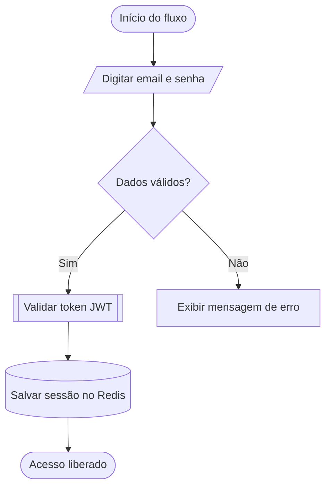

### Tipos de conexões e setas

| Conexão | Sintaxe | Efeito visual |
| :--- | :--- | :--- |
| Seta sólida | `A --> B` | Fluxo direcionado comum |
| Linha contínua | `A --- B` | Conexão direta sem sentido |
| Linha pontilhada | `A -.-> B` | Relação opcional, indireta ou evento |
| Linha grossa | `A ==> B` | Caminho crítico ou fluxo principal |
| Seta com texto | `A -->\|Rótulo\| B` | Fluxo anotado com condição |

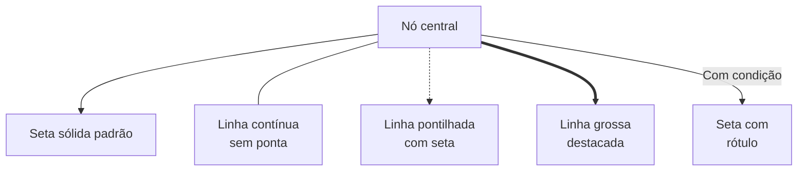

### Sub-grafos (`subgraph`) e direções internas
Permitem delimitar fronteiras de arquitetura (ex: Frontend, Backend, Banco de Dados):

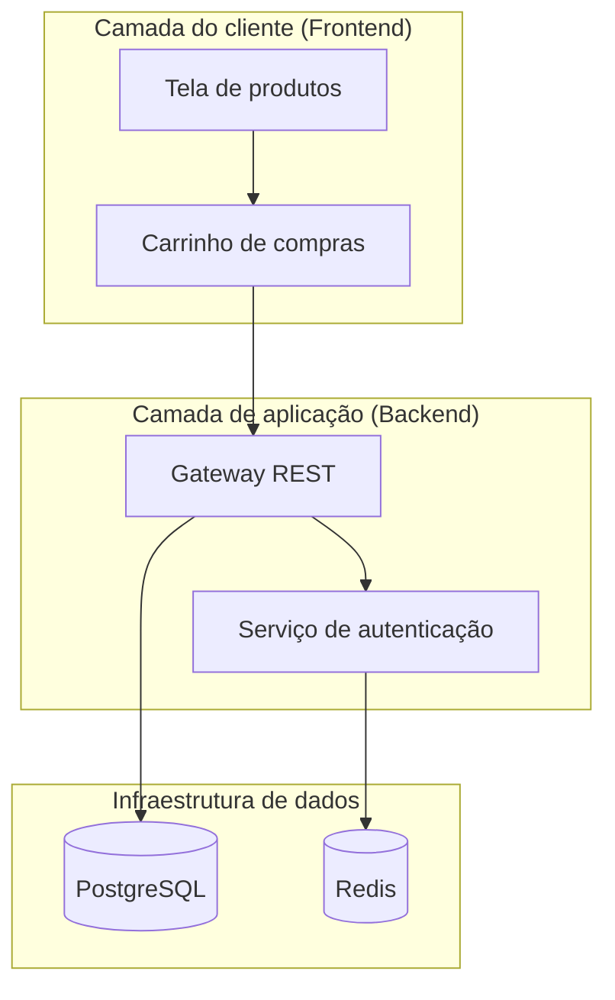

### Estilização e classes CSS no Mermaid
Você pode customizar nós com estilos diretos ou classes reutilizáveis:

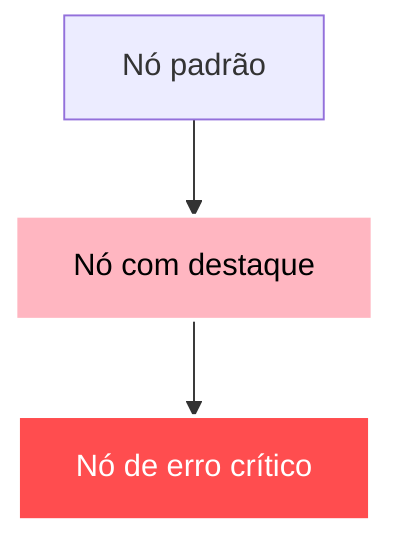

---

## 3. Diagramas de sequência (`sequenceDiagram`)

O diagrama de sequência é o padrão de ouro para documentar processos assíncronos, requisições HTTP, comunicação entre microsserviços e ciclos de eventos no tempo.

### Elementos fundamentais
* **`actor`**: Renderiza a figura humana (boneco de palito / *stick figure*) para representar pessoas reais (usuários, clientes, operadores).
* **`participant`**: Renderiza caixas retangulares representando módulos de código, servidores, APIs ou bancos de dados.
* **`autonumber`**: Numera automaticamente cada passo da troca de mensagens em círculos sequenciais.
* **`as`**: Permite definir um apelido (*alias*) curto no código e um nome visível completo na tela.

### Tipos de flechas e mensagens

| Sintaxe | Estilo | Significado |
| :--- | :--- | :--- |
| `->>` | Sólida com ponta | Mensagem síncrona / Chamada de função |
| `-->>` | Pontilhada com ponta | Resposta ou retorno de dados |
| `-x` | Sólida com cruz | Mensagem síncrona com falha/bloqueio |
| `--x` | Pontilhada com cruz | Resposta com falha/rejeição |
| `-)` | Sólida aberta | Mensagem assíncrona / Disparo de evento |
| `--))` | Pontilhada aberta | Resposta de evento assíncrono |

### Estruturas de controle em sequências
* **Ativações (`activate` / `deactivate` ou `+` / `-`)**: Mostra a barra vertical de processamento do componente.
* **Agrupamento visual (`box`)**: Cria retângulos coloridos ao fundo para agrupar participantes por domínio.
* **Notas (`Note`)**: `Note left of`, `Note right of` ou `Note over A,B`.
* **Condicionais (`alt / else`)**: Caminhos alternativos (sucesso vs erro).
* **Opcional (`opt`)**: Passo que só ocorre sob certas condições.
* **Repetição (`loop`)**: Iterações e tentativas repetidas (*polling/retry*).
* **Paralelo (`par / and`)**: Duas tarefas rodando simultaneamente.
* **Região crítica (`critical / option`)**: Transação atômica que exige tratamento.
* **Quebra de fluxo (`break`)**: Interrupção imediata por erro fatal ou cancelamento.

### Exemplo completo de sequência

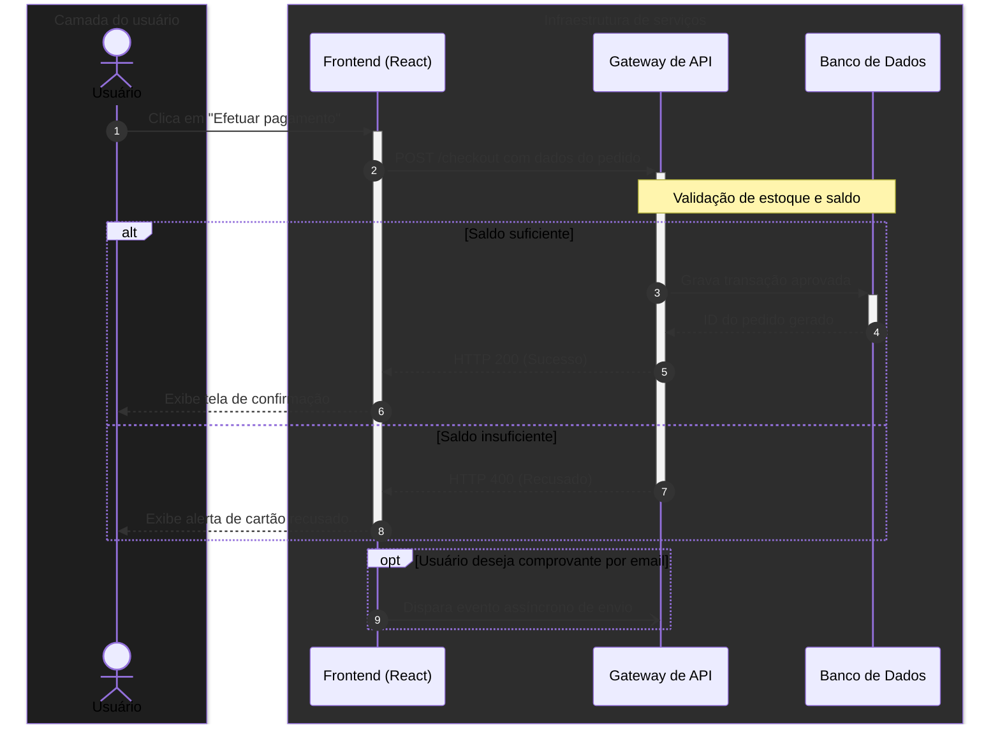

---

## 4. Diagramas de classes (`classDiagram`)

Usado em arquitetura orientada a objetos para documentar propriedades, métodos, encapsulamento e relações entre classes.

### Visibilidade e membros
* `+` : Público (`public`)
* `-` : Privado (`private`)
* `#` : Protegido (`protected`)
* `~` : Pacote / Interno (`package/internal`)
* `{abstract}` : Método ou classe abstrata
* `{static}` : Membro estático da classe

### Relacionamentos entre classes

| Sintaxe | Relação | Descrição |
| :--- | :--- | :--- |
| `<|--` | Herança | Subclasse herda de Superclasse |
| `..|>` | Realização / Interface | Classe implementa um contrato de interface |
| `*--` | Composição forte | A parte não existe sem o todo (ciclo de vida acoplado) |
| `o--` | Agregação | A parte pode existir independentemente do todo |
| `-->` | Associação | Uma classe conhece e utiliza outra |
| `..>` | Dependência | Uma classe usa outra temporariamente em um método |

### Exemplo completo de modelagem de classes

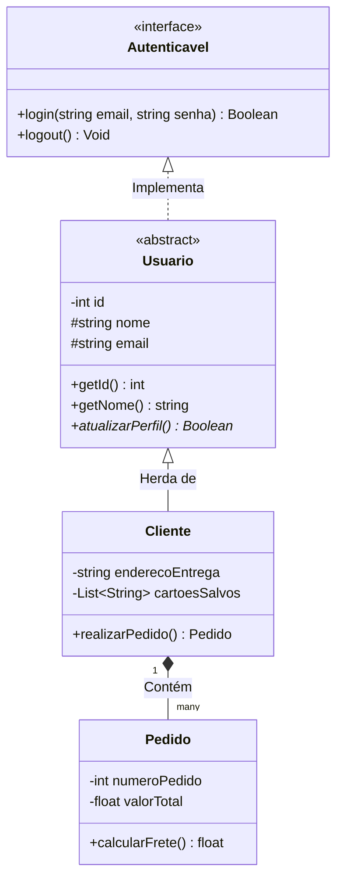

---

## 5. Diagramas de máquina de estados (`stateDiagram-v2`)

Mapeia os estados possíveis de um componente de interface, pedido ou ciclo de vida de uma entidade, além dos gatilhos que causam as transições.

### Elementos
* `[*]`: Ponto inicial e ponto terminal.
* `-->`: Transição entre estados com rótulo `: evento / ação`.
* `state NomeGrupo { ... }`: Estados compostos e aninhados.
* `--`: Divisor de concorrência (estados paralelos acontecendo ao mesmo tempo).
* `<<choice>>`: Ponto de decisão condicional.
* `<<fork>>` e `<<join>>`: Bifurcação e junção de fluxos.

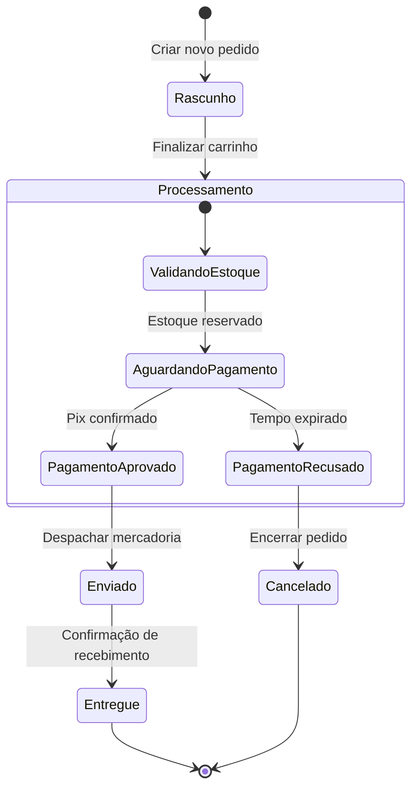

---

## 6. Diagramas de entidade e relacionamento (`erDiagram`)

Mapeia a modelagem de bancos de dados relacionais (tabelas, campos, chaves primárias, estrangeiras e cardinalidades).

### Sintaxe de cardinalidades

| Conector | Significado |
| :--- | :--- |
| `||--||` | Exatamente um para exatamente um |
| `||--o{` | Um para zero ou muitos |
| `||--|{` | Um para um ou muitos |
| `|o--o|` | Zero ou um para zero ou um |
| `}o--o{` | Zero ou muitos para zero ou muitos |

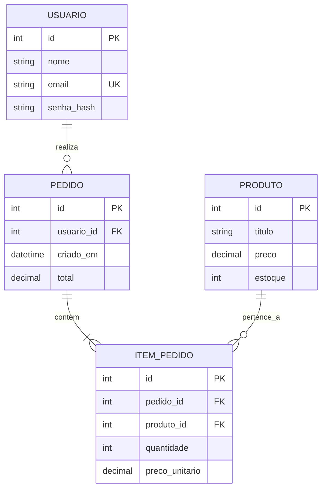

---

## 7. Gráficos de Gantt (`gantt`)

Usado para planejar entregas, cronogramas de sprints, lançamentos de MVPs e acompanhamento de dependências temporais.

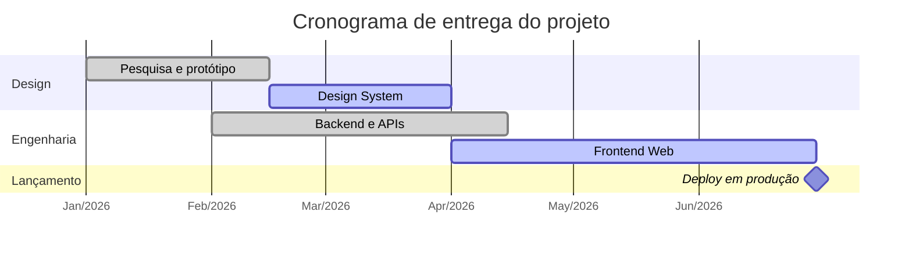

---

## 8. Diagramas de versionamento (`gitGraph`)

Excelente para explicar estratégias de branches (*Git Flow*, *Trunk-based*), pull requests, merges e tags de versão.

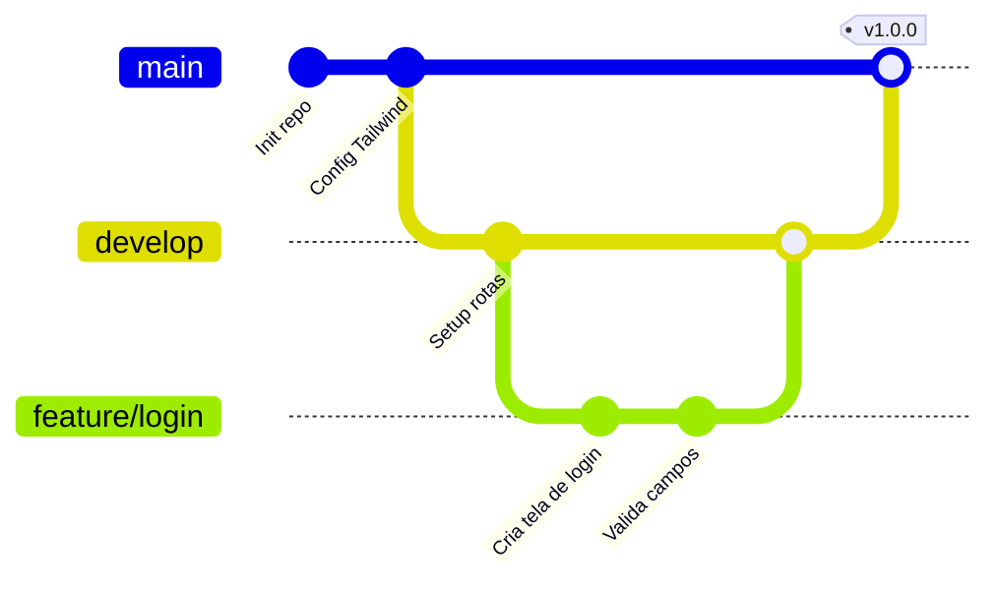

---

## 9. Mapas mentais (`mindmap`)

Ideal para arquitetura de informação, brainstorms, taxonomias de design e organização hierárquica de estudos.

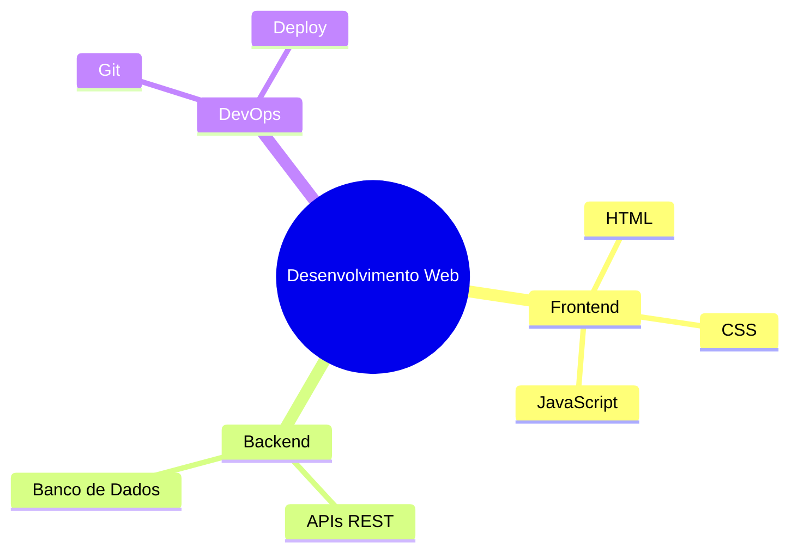

---

## 10. Matrizes e gráficos de quadrantes (`quadrantChart`)

Perfeito para matrizes 2x2 de tomada de decisão em design e produto (ex: Impacto vs Esforço, Urgente vs Importante).

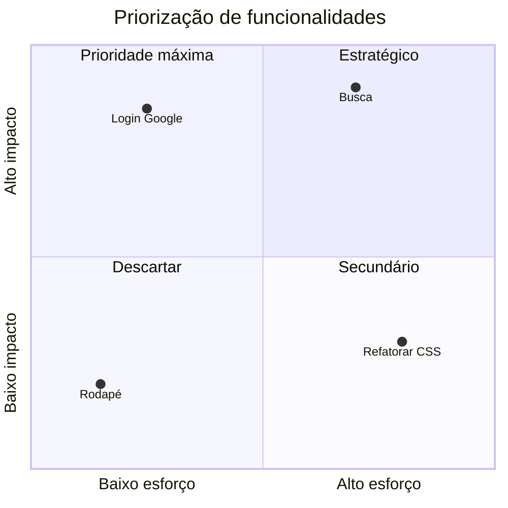

---

## 11. Linha do tempo (`timeline`) e gráficos de pizza (`pie`)

Para documentar marcos históricos, evolução de versões e métricas proporcionais de forma rápida.

### Linha do tempo (`timeline`)
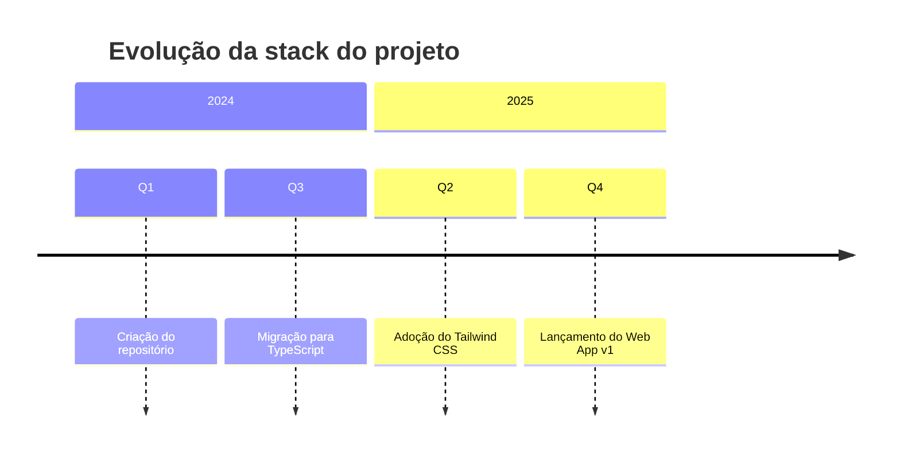

### Gráfico de pizza (`pie`)
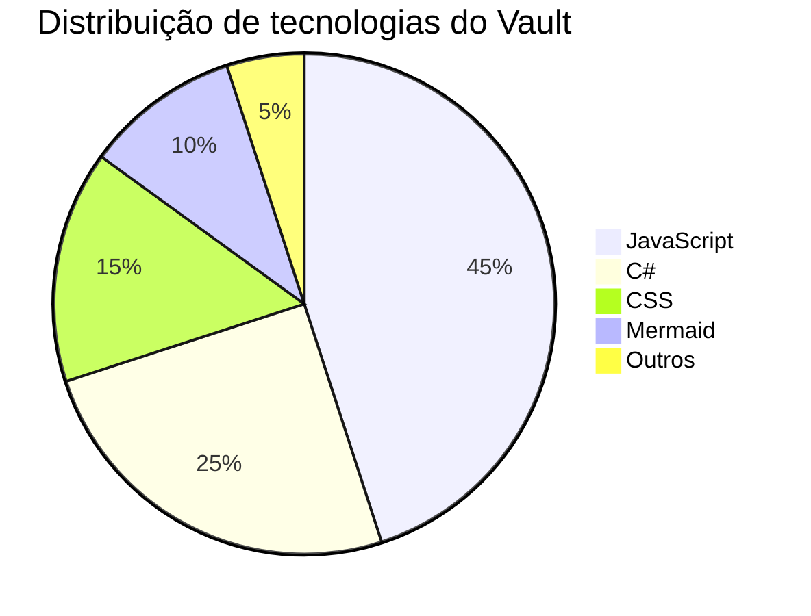

---

## Boas práticas de escrita para evitar erros

1. **Aspas duplas obrigatórias em rótulos**: Se o texto contiver parênteses `()`, colchetes `[]`, barras `/` ou dois-pontos `:`, envolva todo o rótulo em aspas duplas (ex: `A["Texto (Detalhe)"]`).
2. **Evite numeração sequencial com ponto no início**: Não inicie textos com `1. Passo`, pois parsers Markdown podem confundir com listas ordenadas. Prefira `1 - Passo`.
3. **Identificadores curtos e sem espaços**: Use IDs limpos (`UserNode`, `CheckoutBtn`, `ApiGateway`) e coloque o texto explicativo dentro dos delimitadores da forma.
4. **Pipes escapados em tabelas Markdown**: Se for citar sintaxes que contenham pipes dentro de tabelas Markdown, utilize `\|` (ex: `A -->\|Texto\| B`).

---

## Guia de decisão: qual diagrama escolher?

| O que você quer explicar? | Diagrama recomendado | Palavra-chave inicial |
| :--- | :--- | :--- |
| Tomada de decisão, algoritmo ou fluxo de telas | Fluxograma | `flowchart TD` |
| Troca de mensagens entre usuário, app e APIs no tempo | Diagrama de sequência | `sequenceDiagram` |
| Estrutura de classes, herança e interfaces | Diagrama de classes | `classDiagram` |
| Estados de um botão, tela ou pedido (`idle`, `loading`, `error`) | Diagrama de estados | `stateDiagram-v2` |
| Modelagem de tabelas e chaves de banco de dados | Entidade e relacionamento | `erDiagram` |
| Cronograma, sprints e dependências temporais | Gráfico de Gantt | `gantt` |
| Fluxo de branches e merges do Git | Grafo Git | `gitGraph` |
| Hierarquia de conceitos, tópicos e brainstorm | Mapa mental | `mindmap` |
| Matriz de priorização 2x2 (Impacto x Esforço) | Gráfico de quadrantes | `quadrantChart` |
| Marcos e lançamentos cronológicos | Linha do tempo | `timeline` |
| Proporções e métricas percentuais | Gráfico de pizza | `pie` |

---

## Resumo para memorizar

* O Mermaid permite criar diagramas completos usando apenas texto estruturado, garantindo versionamento no Git e legibilidade perfeita.
* No `flowchart`, os delimitadores definem a geometria (`[]` retângulo, `()` arredondado, `([])` pílula, `{}` losango, `[()]` cilindro).
* No `sequenceDiagram`, a figura humana é criada com a palavra-chave **`actor`** e as caixas com **`participant`**.
* Todas as instruções suportam comentários com `%%` e aceitam estilizações visuais diretas para enriquecer a documentação técnica.

