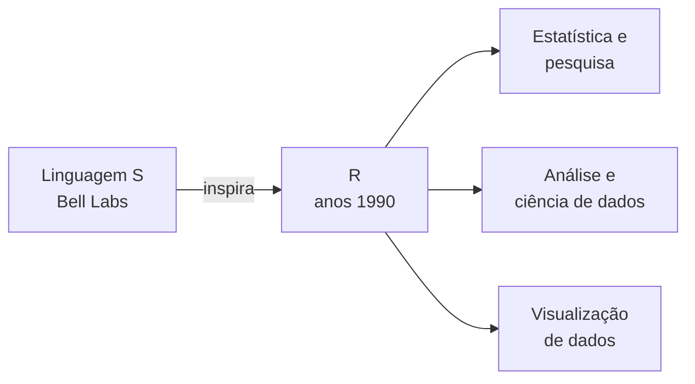
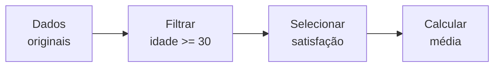
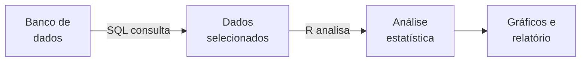
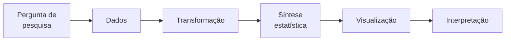

# Introdução ao R — origem, propósito e modelo mental

R é uma linguagem de programação criada em torno de um problema específico: **trabalhar com dados, estatística e análise quantitativa**.

Isso muda bastante a melhor forma de entendê-la. Se JavaScript costuma aparecer quando queremos construir comportamento em uma interface e SQL quando queremos consultar dados armazenados, R aparece com frequência quando a pergunta é:

> **O que esses dados estão dizendo?**

> [!NOTE] Modelo mental
> Pense em R menos como “uma linguagem para construir aplicativos” e mais como uma **bancada de análise programável**. Você coloca dados sobre a bancada, transforma, compara, resume, modela e visualiza esses dados para investigar uma pergunta.

---

## 1. De onde vem o R

R surgiu no início da década de 1990 na Universidade de Auckland, na Nova Zelândia, a partir do trabalho de **Ross Ihaka** e **Robert Gentleman**.

A linguagem foi fortemente inspirada em **S**, uma linguagem para computação estatística desenvolvida anteriormente nos Bell Labs. O nome **R** funciona, portanto, como uma brincadeira com a linguagem S e também com as iniciais de Ross e Robert.

Essa origem ajuda a entender por que R parece diferente de linguagens de propósito geral: seu ecossistema cresceu muito próximo de **estatísticos, pesquisadores, cientistas e pessoas que precisavam explorar dados**.

O centro de gravidade da linguagem não era criar uma interface, um jogo ou um servidor web. Era tornar operações estatísticas e manipulações de dados expressáveis em código.



---

## 2. Para que R serve

R é especialmente usado para:

* explorar conjuntos de dados;
* limpar e transformar dados;
* calcular estatísticas descritivas;
* testar hipóteses;
* construir modelos estatísticos;
* produzir gráficos e visualizações;
* trabalhar com pesquisa quantitativa;
* criar relatórios analíticos reproduzíveis;
* desenvolver análises de ciência de dados.

Imagine uma pesquisa de UX com 2.000 respostas. Você poderia querer descobrir:

* qual é a satisfação média;
* como satisfação varia por idade;
* se dois grupos apresentam diferenças relevantes;
* quais variáveis parecem relacionadas;
* como visualizar a distribuição das respostas.

Esse é exatamente o tipo de situação em que R se sente em casa.

---

## 3. O modelo mental: trabalhar com conjuntos de dados

Uma característica importante de R é que a linguagem foi desenhada para trabalhar naturalmente com **vetores e coleções de observações**.

Considere estas notas:

```r
notas <- c(7, 9, 6, 8, 10)
```

`c()` combina os valores em um vetor.

Para calcular a média:

```r
mean(notas)
```

Para selecionar somente notas maiores ou iguais a 8:

```r
notas[notas >= 8]
```

Observe o modelo mental: não precisamos necessariamente escrever um `for` e visitar manualmente cada posição. Podemos expressar uma operação sobre o vetor inteiro.

Isso é chamado de **operação vetorizada**.

Há uma conexão direta com [[llm/Fundamentos — vetores, matrizes, tensores e shapes|vetores, matrizes e tensores]]: em computação de dados, muitas operações ficam mais naturais quando pensamos em estruturas inteiras, e não apenas em valores isolados.

> [!IMPORTANT] Vetor em R não significa apenas vetor geométrico
> Em R, um vetor é uma estrutura de dados unidimensional contendo valores de um mesmo tipo básico. A ideia matemática de vetor ajuda no modelo mental, mas o termo aqui também tem um significado concreto dentro da linguagem.

---

## 4. O operador `<-`

Em muitos exemplos de R você encontrará isto:

```r
idade <- 31
```

O operador `<-` atribui um valor a um nome.

Podemos ler como:

> coloque `31` em `idade`.

R também aceita `=` em muitos contextos:

```r
idade = 31
```

Mas `<-` é uma convenção histórica muito comum no código R e ajuda a reconhecer imediatamente a linguagem.

---

## 5. Data frame: a estrutura central para análise

Um dos objetos mais importantes em R é o **data frame**.

Ele representa dados tabulares: linhas são normalmente observações e colunas representam variáveis.

Imagine uma pequena pesquisa:

```r
respostas <- data.frame(
  idade = c(22, 31, 27, 45, 36),
  satisfacao = c(4, 5, 3, 2, 4)
)
```

Mentalmente:

| idade | satisfacao |
| ---: | ---: |
| 22 | 4 |
| 31 | 5 |
| 27 | 3 |
| 45 | 2 |
| 36 | 4 |

Podemos acessar uma coluna:

```r
respostas$satisfacao
```

E calcular sua média:

```r
mean(respostas$satisfacao)
```

Aqui aparece uma diferença importante em relação a aprender programação apenas por variáveis isoladas. Em análise de dados, frequentemente pensamos em **colunas inteiras como variáveis de uma investigação**.

---

## 6. Um exemplo de análise

Suponha que queremos saber a satisfação média apenas das pessoas com 30 anos ou mais.

Com R base, uma possibilidade é:

```r
grupo <- respostas[respostas$idade >= 30, ]
mean(grupo$satisfacao)
```

O primeiro comando filtra as linhas. O segundo calcula a média da coluna `satisfacao` no resultado.

O fluxo mental é:



Essa ideia de **pipeline de transformação** aparece com ainda mais clareza no ecossistema moderno de R.

---

## 7. O tidyverse e o jeito moderno de manipular dados

R possui um enorme ecossistema de pacotes. Um dos conjuntos mais influentes é o **tidyverse**, que reúne ferramentas com convenções consistentes para importar, transformar e visualizar dados.

Um pacote muito usado é `dplyr`.

```r
library(dplyr)

respostas |>
  filter(idade >= 30) |>
  summarise(
    media_satisfacao = mean(satisfacao)
  )
```

O operador `|>` é o **pipe nativo** de versões modernas de R. Ele passa o resultado de uma etapa para a próxima.

Podemos ler o código quase como uma frase:

> pegue `respostas` → filtre quem tem pelo menos 30 anos → resuma calculando a satisfação média.

Para alguém vindo de design de serviços ou UX Research, a analogia é próxima de um **fluxo de tratamento da pesquisa**:

**base bruta → critérios de seleção → transformação → síntese → evidência.**

> [!NOTE] R base e tidyverse não são linguagens diferentes
> `dplyr`, `ggplot2` e outros pacotes ampliam R. O núcleo continua sendo a linguagem R. É parecido com a relação entre JavaScript e bibliotecas/ecossistemas construídos sobre JavaScript.

---

## 8. Visualização e ggplot2

Outro pacote extremamente conhecido é `ggplot2`, voltado para visualização de dados.

Um exemplo simples:

```r
library(ggplot2)

ggplot(respostas, aes(x = idade, y = satisfacao)) +
  geom_point()
```

A ideia é declarar:

* qual é o conjunto de dados;
* quais variáveis ocupam cada papel visual;
* qual representação gráfica deve ser usada.

Isso é interessante para quem vem de design porque o gráfico é tratado como uma composição de **camadas e mapeamentos visuais**, em vez de apenas como um comando do tipo “desenhe este gráfico”.

---

## 9. R não é simplesmente “Python para estatística”

R e Python se sobrepõem bastante em ciência de dados, mas têm histórias e ecossistemas diferentes.

Python é uma linguagem de propósito geral. Pode ser usada para backend, automação, scripts, IA, aplicações e análise de dados.

R nasceu muito mais próximo da estatística e da computação científica. Por isso, análise estatística e exploração de dados fazem parte de sua identidade desde a origem.

Uma comparação útil, sem transformar fronteiras flexíveis em regras absolutas:

| Tecnologia | Pergunta que ajuda a imaginar seu papel |
| --- | --- |
| SQL | “Quais dados quero consultar ou organizar no banco?” |
| R | “O que esses dados indicam e como posso analisá-los?” |
| Python | “O que quero analisar, automatizar ou construir com esses dados?” |
| JavaScript | “Como a aplicação e o usuário vão interagir com esses dados?” |

Essas tecnologias podem executar tarefas umas das outras. A tabela mostra seus **centros de gravidade**, não limites rígidos.

---

## 10. R e SQL podem trabalhar juntos

Também não é necessário escolher entre R e SQL.

Em um projeto real, um fluxo poderia ser:



SQL pode fazer a consulta e organização inicial; R pode receber o resultado para exploração, modelagem estatística e visualização.

Isso conecta R diretamente ao estudo de bancos de dados e modelagem relacional: saber estruturar e consultar dados resolve uma parte do problema; saber **investigar o que eles significam** resolve outra.

---

## 11. R é compilado ou interpretado?

Para uma primeira aproximação, R pode ser tratado como uma linguagem **interpretada e interativa**: você escreve uma expressão, executa e observa o resultado imediatamente.

```r
2 + 2
```

```text
[1] 4
```

Isso favorece exploração incremental de dados.

Tecnicamente, a implementação de R possui mais detalhes internos do que a oposição simples “compilado versus interpretado” sugere, incluindo representação intermediária e compilação de bytecode em determinados casos. Portanto, “interpretado” aqui é um **modelo didático de uso**, não uma descrição completa de toda a implementação do runtime.

---

## 12. Onde se escreve R

Arquivos de código R normalmente usam a extensão:

```text
.R
```

Um ambiente historicamente muito associado à linguagem é o **RStudio**, mas R não depende dele. Também é possível trabalhar com R em outros editores, notebooks e ambientes de desenvolvimento.

Além de scripts, o ecossistema de R é bastante usado para documentos que misturam **texto, código, resultados e gráficos**, algo útil para tornar uma análise reproduzível.

---

## 13. Quando vale aprender R

R passa a ser especialmente interessante quando o objetivo envolve:

* estatística com alguma profundidade;
* pesquisa quantitativa;
* ciência de dados;
* análise exploratória;
* visualização de dados;
* produção acadêmica baseada em dados;
* modelos estatísticos;
* relatórios analíticos reproduzíveis.

Para alguém que já trabalha com pesquisa, R pode ser visto como uma forma de transformar etapas que às vezes acontecem manualmente em planilhas em um **processo explícito, repetível e auditável em código**.

Isso é uma mudança importante: não é apenas obter um número, mas registrar exatamente **como aquele número foi produzido**.

---

## 14. Exemplo completo: uma pequena pesquisa de experiência

Este exemplo junta criação da base, filtro, resumo e visualização.

```r
# Instale os pacotes uma única vez, se necessário:
# install.packages("dplyr")
# install.packages("ggplot2")

library(dplyr)
library(ggplot2)

respostas <- data.frame(
  participante = c("P01", "P02", "P03", "P04", "P05", "P06"),
  idade = c(22, 31, 27, 45, 36, 29),
  satisfacao = c(4, 5, 3, 2, 4, 5)
)

resumo <- respostas |>
  filter(idade >= 30) |>
  summarise(
    participantes = n(),
    media_satisfacao = mean(satisfacao)
  )

print(resumo)

ggplot(respostas, aes(x = idade, y = satisfacao)) +
  geom_point() +
  labs(
    title = "Idade e satisfação",
    x = "Idade",
    y = "Satisfação"
  )
```

O mais importante neste momento não é decorar `filter()`, `summarise()` ou `ggplot()`. É perceber a arquitetura da análise:



R fornece uma linguagem para tornar esse percurso reproduzível.

---

## Resumo para memorizar

* **R é uma linguagem de programação**, não apenas um programa estatístico.
* Surgiu nos anos 1990 com Ross Ihaka e Robert Gentleman e foi fortemente inspirado pela linguagem S.
* Seu centro de gravidade é **estatística, análise e visualização de dados**.
* R trabalha naturalmente com **vetores** e dados tabulares.
* **Data frames** organizam observações em linhas e variáveis em colunas.
* Operações vetorizadas permitem trabalhar com conjuntos de valores sem escrever manualmente um loop para cada elemento.
* O **tidyverse** é um ecossistema de pacotes; não é outra linguagem.
* `dplyr` é muito usado para transformação de dados e `ggplot2` para visualização.
* O pipe `|>` ajuda a expressar análises como uma sequência de transformações.
* **R, Python e SQL se sobrepõem**, mas possuem centros de gravidade diferentes.
* R é especialmente valioso quando queremos transformar uma investigação quantitativa em um processo **explícito, reproduzível e auditável**.