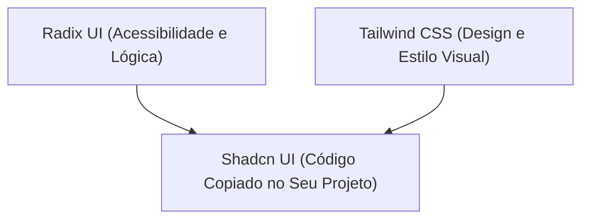

# Bibliotecas de ui e estilização no React - método Feynman

No desenvolvimento front-end moderno com [[react/Introdução ao React\|React]], existem diferentes formas de estilizar componentes e construir interfaces visuais. Em vez de escrever todo o CSS do zero, o mercado utiliza um ecossistema de **bibliotecas de UI (User Interface)** para acelerar a criação de Design Systems e componentes acessíveis.

Sob a perspectiva do **Design de Produto**, esse ecossistema funciona como um **Kit de Componentes do Figma com Diferentes Níveis de Autonomia**.

---

## A analogia do kit do Figma

Imagine criar um Design System no Figma:

*   **Tailwind CSS (A Caixa de Estilos Rápidos / Auto Layout Pronto):** É como aplicar propriedades diretas no painel do Figma (padding, margin, cores HSL, bordas arredondadas) usando atalhos de teclado super rápidos sem precisar abrir o arquivo CSS separado.
*   **Radix UI (Os Componentes Invisíveis com Acessibilidade):** É o esqueleto funcional de um componente no Figma. O modal já sabe abrir, fechar no `Esc` e prender o foco do teclado, mas ele vem sem cor e sem preenchimento para que você aplique a sua própria identidade visual.
*   **Shadcn UI (O Design System Pronto Copia-e-Cola):** É o kit de componentes mais popular do mercado atual. Ele junta o esqueleto do Radix UI com o estilo do Tailwind CSS e te entrega o código fonte dentro do seu projeto para você customizar tudo.
*   **Framer Motion (As Transições e Animações de Prototipagem):** É o motor de animação do Figma acionado por código (fade in, deslisar, expansão de cards ao clicar).

---

## 1. Tailwind CSS: estilização por classes utilitárias

O **Tailwind CSS** é um framework CSS baseado em **utility-first** (classes utilitárias). Em vez de criar um arquivo `.css` e inventar nomes de classes como `.botao-principal-azul`, você aplica classes diretas de estilo no próprio JSX.

### Exemplo em código:
```javascript
function Botao() {
  return (
    <button className="bg-blue-600 hover:bg-blue-700 text-white font-bold py-2 px-4 rounded-lg shadow-md transition">
      Enviar Mensagem
    </button>
  );
}
```

### Por que usar?
* **Zero troca de contexto:** Você estiliza sem sair do arquivo do componente.
* **Tamanho final minúsculo:** O Tailwind remove todo o CSS que não foi utilizado durante o build de produção.
* **Padronização:** Garante que toda a equipe use os mesmos espaçamentos (`p-4`, `p-6`) e paletas de cor do Design System.

---

## 2. Radix ui: componentes headless (sem estilo pré-definido)

O **Radix UI** é uma coleção de componentes primitivos não estilizados (**Headless UI**).

### Para que serve?
Construir modais, menus dropdown, acordeões e tooltips com acessibilidade perfeita (suporte a leitores de tela e navegação por teclado) é extremamente complexo. O Radix entrega toda a **lógica e acessibilidade pronta**, permitindo que você aplique 100% da sua identidade visual usando Tailwind ou CSS puro.

---

## 3. Shadcn ui: o padrão moderno de componentes

O **Shadcn UI** revolucionou a forma de criar interfaces no React. **Ele não é instalado como uma biblioteca comum no `node_modules`**. Em vez disso, ele é uma ferramenta que copia o código fonte dos componentes diretamente para dentro da pasta do seu projeto.

### Como funciona a arquitetura do Shadcn?


### Vantagens:
1. **Propriedade total do código:** Você pode abrir o arquivo `button.jsx` ou `dialog.jsx` e alterar o que quiser, pois o código pertence ao seu projeto.
2. **Design profissional imediato:** Entrega interfaces bonitas, acessíveis e com modo escuro (Dark Mode) pronto.

---

## 4. Framer Motion: animações declarativas

O **Framer Motion** é a biblioteca padrão da indústria para criar animações em React. Ela permite animar elementos HTML usando propriedades simples em JSX.

### Exemplo de animação de entrada (fade in):
```javascript
import { motion } from 'framer-motion';

function CardProduto() {
  return (
    <motion.div
      initial={{ opacity: 0, y: 20 }}
      animate={{ opacity: 1, y: 0 }}
      transition={{ duration: 0.5 }}
      className="p-6 bg-white rounded-xl shadow-lg"
    >
      <h3>Notebook Pro</h3>
    </motion.div>
  );
}
```

---

## 5. Stitches / Styled Components (css-in-js)

Historicamente, bibliotecas como **Styled Components**, **Emotion** e **Stitches** permitiam escrever CSS nativo dentro de arquivos JavaScript usando Template Strings ou Objetos:

```javascript
// Exemplo conceitual de CSS-in-JS (Stitches)
const BotaoEstilizado = styled('button', {
  backgroundColor: 'purple',
  borderRadius: '8px',
  '&:hover': {
    backgroundColor: 'darkpurple'
  }
});
```

*Nota:* Embora o CSS-in-JS tenha sido muito popular, o mercado moderno está migrando fortemente para o ecossistema **Tailwind CSS + Shadcn UI** por questões de desempenho de renderização e compatibilidade com o Server-Side Rendering (SSR).

---

## Resumo comparativo das ferramentas de ui

| Ferramenta | O que é? | Papel no Projeto |
| :--- | :--- | :--- |
| **Tailwind CSS** | Framework de classes utilitárias | Estilizar qualquer elemento de forma ultra rápida. |
| **Radix UI** | Primitivos funcionais unstyled | Garantir acessibilidade em modais, menus e popovers. |
| **Shadcn UI** | Coleção de componentes copia-e-cola | Entregar a interface pronta unindo Radix + Tailwind. |
| **Framer Motion** | Biblioteca de animações | Animar transições de tela, listas e componentes interativos. |
| **Stitches / Styled Components** | Bibliotecas de CSS-in-JS | Estilizar escrevendo código CSS dentro do JavaScript. |

---

## Resumo para memorizar

*   **Tailwind CSS:** As classes de estilo direto no JSX.
*   **Radix UI:** A estrutura funcional e acessível sem cor.
*   **Shadcn UI:** O combo perfeito (Radix + Tailwind) copiado direto para o seu código.
*   **Framer Motion:** A animação fluida baseada em propriedades JSX.
