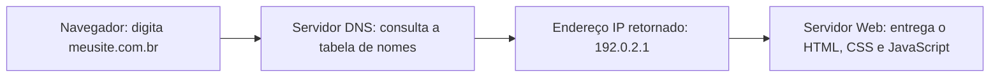
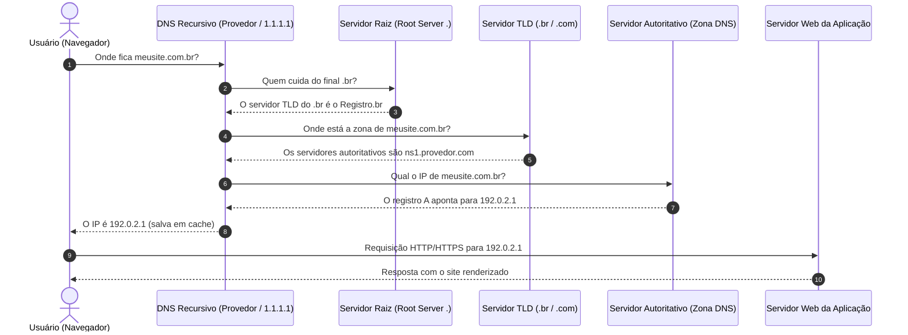
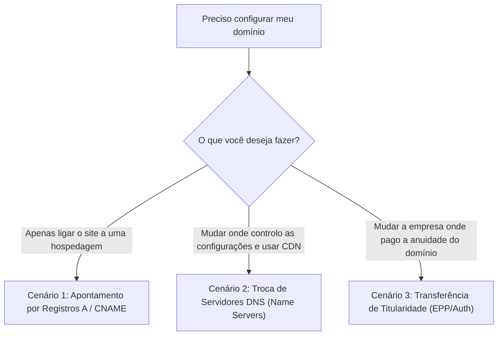
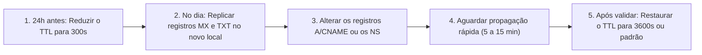

# DNS e gerenciamento de domínios (A, CNAME, TXT, MX e NS)

O **DNS** (*Domain Name System*, ou Sistema de Nomes de Domínio) é a infraestrutura fundamental que permite navegar na internet utilizando nomes fáceis de lembrar (como `google.com` ou `meusite.com.br`) em vez de sequências numéricas complexas de endereços IP (como `142.250.190.46` ou `2800:3f0:4001:817::200e`).

Neste guia, você entenderá o que é o DNS, como funciona a resolução de nomes na internet, o papel de cada registro de configuração (**A**, **AAAA**, **CNAME**, **TXT**, **MX**, **NS**) e o passo a passo seguro para apontar e mover domínios entre serviços sem deixar o site fora do ar.

---

## 1. O que é DNS: a analogia da agenda de contatos

Imagine que para ligar para qualquer pessoa ou empresa, você precisasse digitar de cabeça um número de telefone com 11 dígitos. Seria inviável memorizar centenas de telefones. Em vez disso, você abre a **agenda do seu celular**, busca pelo nome do contato ("Maria", "Pizzaria", "Lucas") e o celular se encarrega de discar o número real de telefone associado àquele nome.

O DNS faz exatamente isso para a internet:

* **O Domínio (`meusite.com.br`)**: É o nome do contato salvo na sua agenda.
* **O Endereço IP (`192.0.2.1`)**: É o número real de telefone do servidor onde os arquivos do site, a [[csharp/25-Consumindo APIs em Csharp|API]] ou a aplicação estão hospedados.
* **O Servidor DNS**: É o sistema operacional do telefone que busca na agenda e faz a chamada para o número correto.

---

## 2. Como funciona a resolução de DNS passo a passo

Quando você digita uma URL no navegador e aperta Enter, uma cadeia de servidores é consultada em milissegundos até encontrar o endereço IP correspondente. Esse processo segue a hierarquia da internet:

### As 4 etapas da hierarquia de consulta

1. **DNS Cache Local e Recursivo (Resolver)**: O navegador e o sistema operacional checam se já conhecem o IP em memória. Se não encontrarem, perguntam ao servidor DNS recursivo configurado na sua rede (como o do provedor de internet, o `1.1.1.1` da Cloudflare ou o `8.8.8.8` do Google).
2. **Servidor Raiz (*Root Server*)**: Existem 13 grupos de servidores raiz espalhados pelo planeta identificados por pontos (`.`). Eles não sabem onde seu site está, mas sabem quem comanda cada terminação de domínio (*TLD*).
3. **Servidor TLD (*Top-Level Domain*)**: Servidores responsáveis por gerenciar extensões específicas como `.com`, `.org`, `.br` ou `.io`. O TLD do `.br` informa quais servidores autoritativos gerenciam aquele domínio específico.
4. **Servidor de Nomes Autoritativo (*Authoritative Name Server*)**: É o servidor que contém a tabela oficial com a **zona DNS** do seu domínio. É aqui que você adiciona e edita os registros A, CNAME, TXT e MX.

---

## 3. Dicionário dos tipos de registros DNS

Ao abrir o painel de controle do seu domínio (no Registro.br, Cloudflare, GoDaddy, Hostinger, AWS Route 53, etc.), você encontrará uma tabela com diferentes tipos de registros. Cada um tem uma função específica e indispensável:

### Registro A (Address)
* **O que faz**: Aponta um domínio ou subdomínio diretamente para um **endereço IPv4** fixo (ex: `192.0.2.1`).
* **Analogia**: É a placa que dá o endereço físico exato de uma casa (Rua X, Número 100).
* **Exemplo de configuração**:
  * **Nome / Host**: `@` (representa a raiz do domínio, ex: `meusite.com`)
  * **Tipo**: `A`
  * **Valor / Destino**: `76.76.21.21` (IP dos servidores da Vercel)
  * **TTL**: `3600` (1 hora)

---

### Registro AAAA (IPv6 Address)
* **O que faz**: Tem a mesma função do registro A, porém aponta para um endereço no formato **IPv6** (endereço de 128 bits mais moderno, com blocos hexadecimais).
* **Exemplo de configuração**:
  * **Nome / Host**: `@`
  * **Tipo**: `AAAA`
  * **Valor / Destino**: `2606:4700:3033::6815:1a3a`

---

### CNAME (Canonical Name)
* **O que faz**: Cria um **apelido (*alias*)** apontando um nome de domínio para outro nome de domínio (e não para um número de IP).
* **Analogia**: Uma placa indicativa que diz: *"Para ir até a Loja Filial, siga o mesmo caminho da Loja Matriz em matriz.empresa.com"*. Se a matriz mudar de endereço IP no futuro, todos os apelidos CNAME continuam funcionando automaticamente sem precisar de ajustes manuais.
* **Exemplo de uso prático**: Apontar `www.meusite.com` ou `app.meusite.com` para a hospedagem do seu projeto na Vercel, Netlify, Shopify ou GitHub Pages.
* **Exemplo de configuração**:
  * **Nome / Host**: `www`
  * **Tipo**: `CNAME`
  * **Valor / Destino**: `cname.vercel-dns.com.`
* **Regra de ouro do CNAME**: De acordo com a especificação original da internet (RFC 1034/1912), **não é permitido criar CNAME na raiz do domínio** (no `@` ou *apex domain* `meusite.com`), porque o CNAME anula todos os outros registros com o mesmo nome (como MX para e-mails e NS). Para contornar isso, serviços modernos como Cloudflare utilizam *CNAME Flattening* ou registros especiais do tipo *ALIAS / ANAME*.

---

### TXT (Text Record)
* **O que faz**: Armazena pequenos textos legíveis por máquinas e serviços externos. É o registro mais versátil da zona DNS.
* **Analogia**: Um crachá ou selo de autenticidade colado na porta da sua empresa para provar que você é o verdadeiro dono dela perante terceiros.
* **Usos principais**:
  1. **Validação de Propriedade**: Plataformas como Google Search Console, Vercel, [[git/01-fundamentos/Integrando a API do GitHub|GitHub]], Apple Developer e Meta pedem para você criar um TXT com um código único (ex: `google-site-verification=abc123xyz...`) para liberar o painel.
  2. **Segurança de E-mail (SPF - Sender Policy Framework)**: Define quais servidores IP estão autorizados a enviar e-mails em nome do seu domínio, evitando que golpistas enviem mensagens falsas (*spoofing*). Exemplo: `v=spf1 include:_spf.google.com ~all`.
  3. **Assinatura Criptográfica (DKIM)**: Chave pública para assinar digitalmente cada e-mail emitido, garantindo que a mensagem não foi alterada no caminho.
  4. **Políticas de Proteção (DMARC)**: Orienta os servidores destinatários sobre o que fazer caso um e-mail falhe no SPF/DKIM (rejeitar ou enviar para quarentena).

---

### MX (Mail Exchange)
* **O que faz**: Especifica quais servidores são responsáveis por **receber os e-mails** enviados para contas do seu domínio (como `contato@meusite.com`).
* **Analogia**: O endereço da caixa postal dos Correios para onde as cartas devem ser entregues.
* **Prioridade de MX**: Cada registro MX recebe um número de prioridade. O servidor com o **menor número** é consultado primeiro; caso esteja fora do ar, o servidor seguinte com número maior assume a recepção.
* **Exemplo de configuração (Google Workspace)**:
  * **Nome**: `@`
  * **Tipo**: `MX`
  * **Prioridade**: `1`
  * **Destino**: `aspmx.l.google.com.`

---

### NS (Name Server)
* **O que faz**: Indica formalmente para o mundo **quais servidores gerenciam e respondem pela zona DNS** do seu domínio.
* **Analogia**: O cartório oficial onde todas as escrituras e documentos do seu terreno estão guardados.
* **Exemplo**: Quando você compra um domínio no Registro.br e decide usar o painel da Cloudflare, você altera os registros NS no Registro.br para apontar para `ada.ns.cloudflare.com` e `bob.ns.cloudflare.com`.

---

### Outros registros relevantes

* **CAA (Certificate Authority Authorization)**: Define explicitamente quais autoridades certificadoras (como Let's Encrypt ou DigiCert) têm permissão de emitir certificados SSL/TLS para o seu domínio, impedindo fraudes.
* **SRV (Service Record)**: Define a localização (porta e protocolo) para serviços específicos, como servidores SIP de voz, Microsoft Teams ou servidores de jogos.
* **SOA (Start of Authority)**: Registro técnico obrigatório criado automaticamente pelo servidor que contém informações administrativas da zona, número de série da versão e intervalos de atualização.

---

## 4. O que significa "mover ou apontar DNS" na prática

Existem três formas completamente diferentes de lidar com domínios, e entender a diferença evita erros e perda de serviços:

### Cenário 1: Apontamento simples de registros (sem trocar NS)
Você mantém a gestão do domínio onde ele foi registrado (ex: Registro.br) e apenas adiciona ou altera linhas específicas na tabela de registros:
* Adiciona o registro `A` ou `CNAME` fornecido pela plataforma de hospedagem (Vercel, Netlify, Hostinger, AWS).
* Seus e-mails continuam funcionando normalmente no mesmo provedor.
* É a forma mais rápida e segura para quem quer apenas subir um site ou página de vendas.

### Cenário 2: Troca de servidores autoritativos (delegar NS)
Você transfere o gerenciamento da **tabela inteira de DNS** para outro serviço (como Cloudflare, AWS Route 53 ou painel da hospedagem):
* Você vai até o registrador de origem e substitui os servidores `NS` pelos novos endereços fornecidos.
* A partir desse momento, novas entradas A, CNAME, TXT e MX só terão efeito se forem criadas no novo painel.
* **Cuidado essencial**: Antes de trocar os servidores NS, copie todos os registros de e-mail (MX e TXT) para o novo painel para que as caixas de correio não parem de receber mensagens durante a migração.

### Cenário 3: Transferência de custódia e faturamento
Você muda a empresa responsável pelo pagamento anual do domínio (ex: transferir da GoDaddy para a Cloudflare Registrar):
* Exige desbloquear o domínio no provedor atual, solicitar a chave de transferência (*Auth Code / EPP Code*) e confirmar os e-mails de autorização.
* Não altera automaticamente para onde o site aponta, apenas muda quem cobrará a anuidade.

---

## 5. TTL e o tempo de propagação

O **TTL** (*Time to Live*, ou Tempo de Vida) é um valor numérico em segundos configurado em cada registro DNS que define por quanto tempo os servidores intermediários do mundo podem guardar aquela resposta em cache antes de perguntar novamente ao servidor oficial.

* **TTL Alto (ex: 86400s = 24 horas)**: Economiza consultas e melhora a velocidade de resposta, mas se você alterar o IP do site, os usuários ao redor do mundo podem demorar até 24 horas para enxergar o novo servidor.
* **TTL Baixo (ex: 300s = 5 minutos)**: Ideal para momentos de migração de servidores, pois qualquer alteração de IP ou CNAME é reconhecida quase em tempo real.

### Estratégia de migração sem queda (Zero Downtime)

---

## 6. Tabela comparativa dos registros de DNS

| Tipo de Registro | Significado | Entrada Aceita | Exemplo de Uso Real | Analogia Feynman |
| :--- | :--- | :--- | :--- | :--- |
| **A** | Address | Endereço IPv4 (números) | `@` -> `76.76.21.21` | Endereço físico e número da casa no mapa. |
| **AAAA** | IPv6 Address | Endereço IPv6 (hexadecimal) | `@` -> `2606:4700:3033::6815` | Coordenada geográfica de alta precisão. |
| **CNAME** | Canonical Name | Nome de domínio (texto) | `www` -> `cname.vercel-dns.com` | Placa de trânsito indicando o caminho da filial. |
| **TXT** | Text Record | Linha de texto livre | `google-site-verification=...` | Crachá de identificação ou selo de autenticidade. |
| **MX** | Mail Exchange | Servidor de e-mail + prioridade | `10 mail.provedor.com` | Caixa postal designada para entrega de cartas. |
| **NS** | Name Server | Servidor autoritativo de DNS | `ns1.cloudflare.com` | Cartório onde o livro de registros está guardado. |
| **CAA** | Cert Authority | Nome da autoridade SSL | `issue "letsencrypt.org"` | Lista de empresas autorizadas a emitir o crachá de segurança. |

---

## Resumo para memorizar

1. **DNS é a lista telefônica da internet**: Converte nomes legíveis para humanos (`meusite.com`) em endereços IP para os computadores se comunicarem.
2. **Registro A aponta para IP (IPv4)**, enquanto **CNAME aponta para outro nome de domínio**.
3. **Nunca use CNAME na raiz do domínio (`@`)**, a menos que seu provedor ofereça a tecnologia de *CNAME Flattening / ALIAS*.
4. **Registro TXT** serve para comprovar propriedade do domínio e proteger seus e-mails contra fraudes com **SPF, DKIM e DMARC**.
5. **Registro MX** controla exclusivamente para onde vão os e-mails enviados para o seu domínio e utiliza prioridades numéricas.
6. **Mover DNS alterando NS** transfere toda a autoridade de gerenciamento de registros para um novo painel.
7. **Diminua o TTL para 300 segundos** um dia antes de fazer grandes migrações para que a propagação ocorra em minutos, evitando instabilidades.
